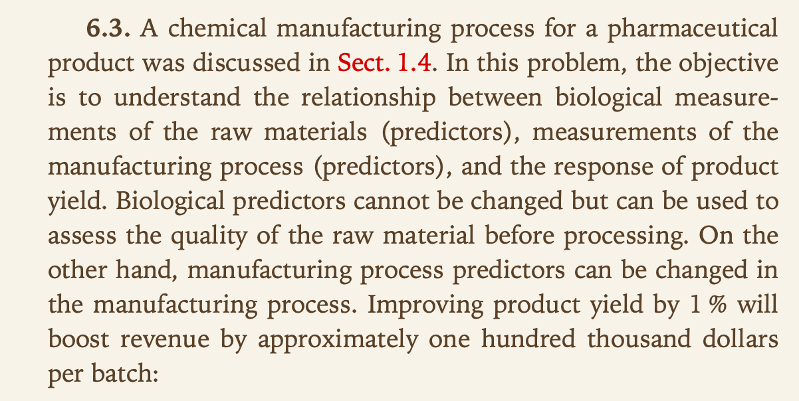
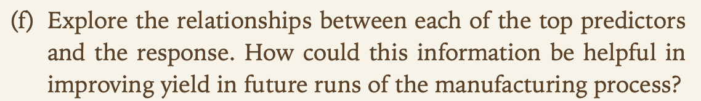

```{r, include=FALSE}
knitr::opts_chunk$set(echo = TRUE)
knitr::opts_chunk$set(tidy = TRUE)
knitr::opts_chunk$set(warning = FALSE)
libs <- c("tidyverse", "knitr", "kableExtra", "glue", "magrittr", "AppliedPredictiveModeling", "caret", "viridis")
loadPkg <- function(x) {
  if(!require(x, character.only = T)) install.packages(x, dependencies = T, repos = "http://cran.us.r-project.org")
  require(x, character.only = T)
}
lapply(libs, loadPkg)
```

# KJ6

## 6.3



### a


```{r}
data("ChemicalManufacturingProcess")
data <- ChemicalManufacturingProcess %>%
  as.data.frame()

# split dataset into predictors and yield
Xs <- data %>%
  select(-Yield)
y <- data %>%
  select(Yield)
```


### b


```{r}
missing <- sum(is.na(Xs))
missingPercent <- missing/(nrow(data) * ncol(data))
```

The `r missing` missing values corresponds to `r missingPercent %>% multiply_by(100) %>% round(2)` of all the predictor data

```{r}
missingPredictors <- Xs %>%
  gather(predictor, value) %>%
  group_by(predictor) %>%
  summarise(missing = sum(is.na(value))) %>%
  mutate(percent = (missing/sum(missing)) * 100) %>%
  filter(missing > 0) %>%
  arrange(desc(missing))

print(missingPredictors)
missingPredictors$missing[c(1:3)]
```

* All of the variables missing data describe Manufacturing Processes
* MP3, MP11, and MP10 make up `r (sum(missingPredictors$missing[c(1:3)])/sum(missingPredictors$missing)) * 100`% of the missing information

The data can be preprocessed and imputed
```{r}
library(caret)
Xs_processed <- preProcess(Xs, method = c("knnImpute", "center", "scale", "nzv", "corr"))

# apply preprocessing and imputation
Xs_trans <- predict(Xs_processed, Xs)
```

Lets just confirm the distribution of the transformed data to ensure appropriateness
```{r}
Xs_trans %>%
  gather(predictor, value) %>%
  mutate(type = ifelse(substr(predictor, 1, 1) == "B", "Biological", "Mechanical"),
         number = substr(predictor, nchar(predictor) - 1, nchar(predictor))) %>%
  ggplot(aes(x = predictor, y = value)) + 
  geom_point(aes(col = type), alpha = 0.5) +
  scale_x_discrete(NULL, labels = NULL) +
  scale_y_continuous(limits = c(-10, 10)) +
  coord_flip() +
  ggtitle("Distribution of Predictors") +
  theme(legend.position = c(1, 1), legend.justification = c(1.1, 1.1))
```

The plot confirms that the preprocessing did well

### c


```{r}
set.seed(7)
trainRows <- createDataPartition(y$Yield, p=.8, list = F)

# training sets
X_train <- Xs_trans[trainRows,]
y_train <- y[trainRows,]

# test sets
X_test <- Xs_trans[-trainRows,]
y_test <- y[-trainRows,]
```

Lets check the correlation of the values
```{r}
cor(Xs_trans) %>%
  # convert to data frame
  as.data.frame() %>%
  # change row names to variable
  rownames_to_column("predictorX") %>%
  # convert to tidy format for plotting
  gather(predictorY, cor, -predictorX) %>%
  # plot 
  ggplot(aes(predictorX, predictorY)) +
  geom_raster(aes(fill = cor)) +
  scale_x_discrete(NULL, labels = NULL) + 
  scale_y_discrete(NULL, labels = NULL) +
  viridis::scale_fill_viridis(NULL) +
  ggtitle("Correlation between predictors") +
  theme(legend.position = "bottom")
```

The correlation plot reveals that some correlation between variables still exists. We can attempt to recitfy this through the use dimensionality reduction

```{r}
set.seed(7)
cv <- trainControl(method = "cv", number = 15)

trainCV <- train(x = X_train, y = y_train, method = "pls", tuneLength = 20, trControl = cv)
```

```{r}
trainCV$results %>% 
  ggplot(aes(x = ncomp)) +
  geom_line(aes(y = RMSE, col = "RMSE")) +
  geom_line(aes(y = Rsquared, col = "R-squared")) +
  geom_line(aes(y = MAE, col = "MAE")) +
  geom_point(data = data_frame(Metric = c("RMSE", "R-squared", "MAE"),
                               ncomp = c(which.min(trainCV$results$RMSE),
                                         which.max(trainCV$results$Rsquared),
                                         which.min(trainCV$results$MAE)),
                               Optimal = c(min(trainCV$results$RMSE),
                                           max(trainCV$results$Rsquared),
                                           min(trainCV$results$MAE))),
             aes(x = ncomp, y = Optimal, col = Metric), size = 1.5) +
  scale_color_discrete("Metric", breaks = c("RMSE", "MAE", "R-squared")) +
  labs(title = "Components (Number) Accuracy",
       subtitle = "15 Fold CV Partial Least Squares",
       x = "Number of PLS components", y = NULL) +
  theme(legend.position = "bottom", legend.direction = "horizontal")
```

The optimal model, based on RMSE, uses `r which.min(trainCV$results$RMSE)` components with an RMSE value of `r min(trainCV$results$RMSE)` based on the plot above


### d


```{r}
predictions <- predict(trainCV, X_test)
yhat_performance <- defaultSummary(data.frame(obs = y_test, pred = predictions)) %T>%
  print
```

The RMSE is `r yhat_performance[1]`, which is slightly better than the RMSE on the training set


### e


```{r}
importantVars <- varImp(trainCV)

importantVars %>%
  ggplot(top = 10) + 
  ggtitle("Top 10 Predictors")
```

* 7 of the Top 10 important variables are Manufacturing
* M32 is the most important registering 100% importance


### f


```{r}
top5 <- rownames(importantVars$importance)[order(importantVars$importance$Overall, decreasing = TRUE)][1:5]

top5_df <- as.data.frame(cbind(Xs_trans, y)[, c(top5, "Yield")])

top5_df %>% 
  gather(predictor, value, -Yield) %>% 
  ggplot(aes(x = value, y = Yield)) +
  geom_point(alpha = 0.25) +
  stat_smooth(se = FALSE, method = "glm") +
  facet_wrap(~ predictor, nrow = 2, scales = "free") +
  labs(title = "Top 5 Predictor Relationships")
```

* M09, M32 have positive relationships with Yield
* M13, M17, and M36 have negative relationships with Yield
* Using this information, increasing M09 and M32 will increase Yield, while decreasing the others will also increase Yield
* The relationships between the variables need to be explored first prior to adjusting manufacturing strategy

