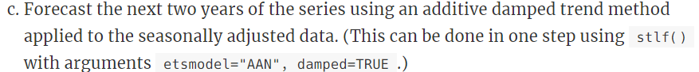
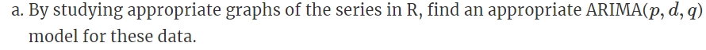

--- 
title: "Data 624 - HA Assignments (HW1)"
author: "Group 1: Andrew Carson, Nathan Cooper, Baron Curtin, Heather Geiger"
date: "`r Sys.Date()`"
site: bookdown::bookdown_site
output: bookdown::gitbook
documentclass: book
bibliography: [book.bib, packages.bib]
biblio-style: apalike
link-citations: yes
github-repo: baroncurtin2/data624
description: "Group 1's HA Homework Assignments"
---

```{r include=FALSE}
# automatically create a bib database for R packages
knitr::write_bib(c(
  .packages(), 'bookdown', 'knitr', 'rmarkdown'
), 'packages.bib')
```

# Introduction
The work herein constitutes the work of Andrew Carson, Nathan Cooper, Baron Curtin, and Heather Geiger in the course Data 624 towards completion of the first set of homework assignments due for Professor Burk.

<!--chapter:end:index.Rmd-->

```{r, include=FALSE}
knitr::opts_chunk$set(echo = TRUE)
knitr::opts_chunk$set(tidy = TRUE)
knitr::opts_chunk$set(warning = FALSE)
libs <- c("tidyverse", "knitr", "kableExtra", "fpp2", "glue")
loadPkg <- function(x) {
  if(!require(x, character.only = T)) install.packages(x, dependencies = T, repos = "http://cran.us.r-project.org")
  require(x, character.only = T)
}
lapply(libs, loadPkg)
```

# HW1

## 2.3


### a


```{r}
retailData <-  readxl::read_excel('./week1/retail.xlsx', skip=1)
```


### b


```{r}
myts <- ts(retailData[, "A3349338X"],
           frequency = 12,
           start=c(1982,4))
```


### c


```{r}
autoplot(myts[, "A3349338X"]) +
  ggtitle("Time Series Plot A3349338X") +
  xlab("Year") +
  ylab("Value")
```

From the time series plot, we able to deduce:
* Trend: there is a clear upward trend over the duration of the time series

```{r}
ggseasonplot(myts, year.labels = T) +
  ggtitle("Seasonal plot: A3349338X")
ggsubseriesplot(myts) +
  ggtitle("Seasonal subseries pllot: A3349338X")
```

From the seasonal plot,  we are able to deduce:
* Seasonality: there is some clear seasonality that exists among different month, however it is not without minor variation/deviation between the years
* December shows a clear uptick while February shows a clear downtick

```{r}
ggAcf(myts)
```

From the Acf plot, we are able to confirm:
* Trend: the autocorrelations are slowly decreasing as the lags are increasing

Conclusion:
* Trend exists in this time series and is slowly going upwrd
* Seasonality appears to exist however there are years that defy seasonality patterns
* There does not appear to be any cyclic behavior

## 2.7


```{r}
#arrivals <- data("arrivals")
```

```{r}
autoplot(arrivals) +
  ggtitle("Arrivals Time Series") +
  facet_wrap(~series)
```

Observations:
* Japan seems to experience a an upward trend, reach an apex, and then experience a downward trend
* NZ, UK, and US all experience upward trends in arrivals albeit to different degrees
* UK appears to have the greatest variance in their arrival figures
* US has very little deviation in their arrival trend
* NZ has more fluctuation than US, but less than UK in their arrivals
* US on average has the lowest amount of arrivals

```{r}
genSeasonPlot <- function(country) {
  ggseasonplot(arrivals[, country]) +
    ggtitle(glue("Season Plot: {country}"))
}
countries <- c("Japan", "NZ", "US", "UK")
countries %>%
  map(~ genSeasonPlot(.x))
```

Observations from Seasonal Plots:
* Typically the countries will see their highest arrivals in Q3, however the UK appears to go against this seasonal pattern
* Q2 appears to be a down quarter for all countries except NZ
* Q1 is a low point for NZ, and generally a high point for the other countries

```{r}
genSubSeasonPlot <- function(country) {
  ggsubseriesplot(arrivals[, country]) +
    ggtitle(glue("Subseries Plot: {country}"))
}
countries %>%
  map(~ genSubSeasonPlot(.x))
```

Observations:
* Japan's mean stays relatively flat across the quarters outside of Q2
* US also remains relatively consistent and further backs up the lack of deviation point made earlier
* UK experiences the most arrivals in Q1 and A4


## 2.10


```{r}
data("dj")
ddj <- diff(dj)
```

```{r}
autoplot(ddj)
```

The autoplot appears to show random variation with peaks and valleys 


```{r}
ggAcf(ddj)
```

The changes in the Dow Jones Index do appear to be white noise as the the autocorrelations are very close to zero

## 3.1


### usnetelec
```{r}
data("usnetelec")
lambda <- BoxCox.lambda(usnetelec) %>%
  print()
autoplot(BoxCox(usnetelec, lambda))
```


### usgdp
```{r}
data("usgdp")
lambda <- BoxCox.lambda(usgdp) %>%
  print()
autoplot(BoxCox(usgdp, lambda))
```


### mcopper
```{r}
data("mcopper")
lambda <- BoxCox.lambda(mcopper) %>%
  print()
autoplot(BoxCox(mcopper, lambda))
```


### enplanements
```{r}
data("enplanements")
lambda <- BoxCox.lambda(enplanements) %>%
  print()
autoplot(BoxCox(enplanements, lambda))
```


## 3.8


### a


```{r}
myts.train <- window(myts, end=c(2010,12))
myts.test <- window(myts, start=2011)
```

### b


```{r}
autoplot(myts) +
  autolayer(myts.train, series="Training") +
  autolayer(myts.test, series="Test")
```

The autoplot shows that the data has been correctly split with the latter part of the data reservered for testing

### c


```{r}
fc <- snaive(myts.train)
print(fc)
```

### d


```{r}
accuracy(fc, myts.test)
```

Conclusions:
* The MASE shows that the seasonal naive method does produce a better forecast than the average naive forecast although very slightly. The MASE is only .95
* The MAPE shows that there is about a 9% error in the forecast on average which is not bad, but does show tht it could be improved
* The RMSE and MAE both show that it is possible to improve the forecast but the seasonal naive forecast does do a decent job

### e


```{r}
checkresiduals(fc)
```

The residual diagnostics show:
* An approximately normal distribution
* The mean of the residuals is close to 0
* The residual variance appears to be contant
* The residuals appear to be correlated as the lags near to each other are similar in direction and size
* Although the residuals pass the diagnostic tests, it does still show that the prediction intervals may be inaccurate
* The Box-Ljung test does show a very small p-value which means the residuals are distinguishable from a white noise series. The Q* value is also very large

### f


Accuracy measures are very sensitive to the training/test split. Forecasts by definition need historical data. The more information present

<!--chapter:end:01-Week1-HW.Rmd-->

```{r, include=FALSE}
knitr::opts_chunk$set(echo = TRUE)
```

# HW2


## 6.2


### a


```{r, include=TRUE}
autoplot(plastics) + xlab("Month") + ylab("1000 $") +
  ggtitle("Monthly Plastic Sales")
```

The data has approximately 1 month (peak to peak) seasonality and an apprearent upward trend, that may be cyclic behavior since this only covers 6 months of data.


### b


```{r}
plastics
autoplot(plastics)
plas_trend <- ma(plastics, order = 12, centre = TRUE)
plas_trend
autoplot(plas_trend)
plas_detrend <- plastics/plas_trend
plas_detrend
plas_seas <- colMeans(t(matrix(plas_detrend,nrow = 12)), na.rm = TRUE)
plas_seas
autoplot(as.ts(plas_seas))
random_plas = plastics/ (plas_trend* plas_seas)
(random_plas)
random_plas
```

```{r}
plastics %>% decompose(type="multiplicative") %>%
  autoplot() + xlab("Month") +
  ggtitle("Classical multiplicative decomposition
    of Plastic Sales")
```

```{r}
plastics %>% decompose(type="multiplicative")
```


### c


Yes the trend is sloped upward and the seasonal trend reaches maximum once a month.


### d


```{r}
plas_seas <- decompose(plastics, type = 'multiplicative')$seasonal
plas_seas
plas_seas_adj = plastics/plas_seas
autoplot(plas_seas_adj)
```


### e


```{r}
plastics[30]
new_val <- plastics[30]+500
plas_outlier <- replace(plastics,30, new_val)
plas_outlier[30]
plas_seas_outlier <- decompose(plas_outlier, type = 'multiplicative')$seasonal
plas_seas_outlier
plas_seas_adj_outlier = plas_outlier/plas_seas_outlier
autoplot(plas_seas_adj_outlier)
```

It adds a spike to the seasonally adjusted data where the outlier is.


### f


```{r}
plastics[5]
new_val <- plastics[5]+500
plas_outlier <- replace(plastics,5, new_val)
plas_outlier[5]
plas_seas_outlier <- decompose(plas_outlier, type = 'multiplicative')$seasonal
plas_seas_outlier
plas_seas_adj_outlier = plas_outlier/plas_seas_outlier
autoplot(plas_seas_adj_outlier)
```

```{r}
plastics[55]
new_val <- plastics[55]+500
plas_outlier <- replace(plastics,55, new_val)
plas_outlier[55]
plas_seas_outlier <- decompose(plas_outlier, type = 'multiplicative')$seasonal
plas_seas_outlier
plas_seas_adj_outlier = plas_outlier/plas_seas_outlier
autoplot(plas_seas_adj_outlier)
```

Yes, the spike occurs where the outlier is.


## 6.6


### a


```{r, include=TRUE}
bricksq %>% autoplot()
bricksq %>%
  stl(t.window=13, s.window="periodic", robust=TRUE) %>%
  autoplot()
bricksq %>%
  stl(t.window=13, s.window=7, robust=TRUE) %>%
  autoplot()
bricksq %>%
  stl(t.window=13, s.window=25, robust=TRUE) %>%
  autoplot()
bricksq %>%
  stl(t.window=13, s.window=81, robust=TRUE) %>%
  autoplot()
```

We see that a high s.window yeilds the same as periodic.

```{r, include=TRUE}
bricksq %>% autoplot()
bricksq %>%
  stl(t.window=13, s.window="periodic", robust=TRUE) %>%
  autoplot()
bricksq %>%
  stl(t.window=25, s.window="periodic", robust=TRUE) %>%
  autoplot()
bricksq %>%
  stl(t.window=7, s.window="periodic", robust=TRUE) %>%
  autoplot()
bricksq %>%
  stl(t.window=3, s.window="periodic", robust=TRUE) %>%
  autoplot()
```

The t.window parameter adjusts the goodness of fit of the trend, low values tend to under fit the trend, and high values tend to over fit the trend.


### b


```{r, include=TRUE}
brick_seas <- decompose(bricksq, type = 'multiplicative')$seasonal
brick_seas
brick_seas_adj = bricksq/brick_seas
autoplot(brick_seas_adj)
```


### c


```{r, include=TRUE}
brick_naive <- naive(brick_seas_adj, h=12)
brick_naive
autoplot(brick_seas_adj) +
  autolayer(brick_naive,
    series="Naïve", PI=TRUE)
```


### d


```{r, include=TRUE}
fcast <- stlf(brick_seas_adj, method='naive')
autoplot(fcast)
```


### e


```{r, include=TRUE}
res_brk <- residuals(brick_naive)
autoplot(res_brk)
gghistogram(res_brk) + ggtitle("Histogram of residuals")
ggAcf(res_brk) + ggtitle("ACF of residuals")
res_fcast <- residuals(fcast)
autoplot(res_fcast)
gghistogram(res_brk) + ggtitle("Histogram of residuals")
```

They seem to increse as time increases, so no they do not look uncorrelated. Also a couple of the lags show significance, that may or may not be by chance.


### f


```{r, include=TRUE}
brick_stl <- brick_seas_adj %>% stlf(t.window=7, s.window="periodic", method = 'naive', robust=TRUE) 
brick_stl %>% autoplot()
```

In this instance, it the residuals appear to behave similarly to a STL decompostion that is not robust.

```{r}
res_brk2 <- brick_stl %>% residuals()
res_brk2 %>% autoplot()
gghistogram(res_brk2) + ggtitle("Histogram of residuals")
ggAcf(res_brk2) + ggtitle("ACF of residuals")
```


### g


```{r}
train <- bricksq %>% window(1956, c(1992, 3))
test <- bricksq %>% window(c(1992, 4), c(1994, 4))
train_stlf <- train %>% stlf(method='naive', h=8)
train_snaiv <- train %>% snaive(h=8)
autoplot(bricksq) +
  autolayer(train_stlf, series="STL", PI=FALSE) +
  autolayer(train_snaiv, series="Seasonal naïve", PI=FALSE) +
  xlab("Quarter") + ylab("Bricks") +
  ggtitle("Forecasts for quarterly brick production") +
  guides(colour=guide_legend(title="Forecast"))
```

From the graphs, it is hard to tell.

```{r}
accuracy(train_snaiv, test)
accuracy(train_stlf, test)
```

From the accuracy fucnction, it appears that the STL decomposition performs better by yeilding less error in ME, RMSE, MAE, MPE, MAPE, and MASE.

<!--chapter:end:02-Week2-HW.Rmd-->

```{r, include=FALSE}
knitr::opts_chunk$set(echo = TRUE)

loadPkg <- function(x) {
  if(!require(x, character.only = T)) install.packages(x, dependencies = T, repos = "http://cran.us.r-project.org")
  require(x, character.only = T)
}

loadPkg("mlbench")
data(Glass)
str(Glass)
```

# HW3


## 3.1


### 3.1a


  Answer:
  I use histograms to understand the distribution of each predictor variable.  The variables differ quite a bit.  Some are more normally distributed (e.g., Na, Al) while others do not look normal at all (e.g., Ba, Fe, K).
  
```{r}
#predictor distributions.  examples.
for(i in c(2, 6, 9)){
  hist(Glass[,i], main = names(Glass)[i], xlab = names(Glass)[i], breaks = 20)
}
```

I use a correlation plot to help me understand the correlations between predictors.  There are some strong positive relationships (i.e., Rl and Ca, Al and Ba) as well as some strong negative relationships (i.e., Rl and Si, Rl and Al, Mg and Ba).  Most relationships are not very strong.

```{r, message=FALSE}
#relationships between predictors
loadPkg("corrplot")
correlations <- cor(Glass[,1:9])
corrplot(correlations)

```


### 3.1b


Answer: Yes, there do appear to be outliers.  "K" has a very obvious outlier with a value of 6. "Ba" also has outliers at above 2.0,and "Fe" has an outlier above 0.5.  Skew is also present in many predictors.  While some have only minor skew (e.g., Rl, Al), others are much more pronounced and obvious (e.g., Mg, Ba, Fe)


### 3.1c


Answer: Yes, a log or Box Cox transformation could help remove the skew mentioned above.  Depending on what kind of classification model we are using, centering and scaling could be important for all variables.  For example, a logistic regression classification type model will be much more sensitive to variables on different scales than a decision tree.  Removing the outliers may still be required after addressing skew, so that may be needed as well to improve model performance.  Thankfully, there are no missing values in any columns, so we do not need to address those by imputation, removal, or other means.  


## 3.2


```{r}
loadPkg("mlbench")
data(Soybean)
```


### 3.2a


Answer: The frequency distributions for the categorical predictors are degenerate.  Most consist of two or three values, so the distributions are not normal.  This is not surprising as the values are categorical, not continuous.  Often the values in the variables are not evenly distributed by frequency, with one or more values having a much greater frequency than others (e.g., leaf.marg has many 0 and 2 but few 1).  
  
```{r, message=FALSE, warning=FALSE}
#frequency distributions.  examples
for(i in c(4,13,15)){
  plot(Soybean[,i], main = names(Soybean)[i])
}

```

There are lots of missing values in the data set as a whole, and nearly every variable has missing values.  

```{r, message=FALSE, warning=FALSE}
#summary.  show missing value counts
summary(Soybean[,2:36])
```

Furthermore, once the variables are transformed into dummy variables, there are clear cases of collinearity (e.g., roots value "2" has 0.96 correlation with fruit pods value "2", shriveling value "1" has 0.86 correlation with seed size value "1").  So the data has lots of issues from a modeling perspective.

```{r, message=FALSE, warning=FALSE}
#collinearity
loadPkg("caret")
soy_dummy_model <-dummyVars(~., data=Soybean[,2:36])
soy_dummy <-predict(soy_dummy_model, Soybean[,2:36])
soy_dummy<-data.frame(soy_dummy)

#correlation plot
corr_soy<- cor(soy_dummy, use = "pairwise.complete.obs")
corrplot(corr_soy)
  
```


### 3.2b


  Answer:
  Yes, there are particular predictors that are more likely to be missing.  A count of NAs below shows that we have counts of NAs in each column ranging from 0 through 121.  A distribution of the NA counts shows that it not normally distributed, and that there are gaps in the middle of the range (40 to 80).
  
```{r, message=FALSE, warning=FALSE}
loadPkg("dplyr")

#get counts of NAs
df_na <-c()
for(i in 2:36){
  name <- names(Soybean)[i]
  count <-sum(is.na(Soybean[,i]))
  row <-c(name, count)
  df_na <- rbind(df_na, row)
}
df_na <- data.frame(df_na, row.names = NULL, stringsAsFactors = FALSE)
names(df_na)<-c("Variable", "NA_Count")
df_na$NA_Count <- as.integer(df_na$NA_Count)
head(arrange(df_na, desc(NA_Count)), n=10)

#hist
hist(df_na$NA_Count, breaks = 10)

```
  
  Is the pattern of missing data related to the classes?  There are 19 classes, and there is definitely a pattern related to the classes. The classes below have repeated counts of missing values across multiple variables:
  
  * 2-4-d-injury: 16
  * cyst-nematode: 14
  * diaporthe-pod-&-stem-blight: 15
  * herbicide-injury: 8
  * phytophthora-rotL: 68 or 55
  
```{r, message=FALSE, warning=FALSE}
#get NAs by class
Soybean_NA <-is.na(Soybean)
Soybean_NA[Soybean_NA==TRUE] <-1
Soybean_NA <- data.frame(Soybean_NA)
Soybean_NA$Class <- as.character(Soybean$Class)

#group to get count of NAs per column by class value
Soybean_NA_grouped <- Soybean_NA %>% group_by(Class) %>%
  summarise_all(funs(sum(.)))
Soybean_NA_grouped

```
In fact, these 5 classes are the only classes that have missing values.
  
```{r, message=FALSE, warning=FALSE}
#calculate totals of NAs by class
totals <-rowSums(Soybean_NA_grouped[,2:36])
Soybean_NA_totals <- data.frame(cbind(Soybean_NA_grouped$Class, totals), stringsAsFactors = FALSE)
names(Soybean_NA_totals) <-c("Class","Totals")
Soybean_NA_totals$Totals <- as.integer(Soybean_NA_totals$Totals)
head(arrange(Soybean_NA_totals, desc(Totals)), n=10)

```


### 3.2c


Answer:  Since missing values are related to particular classes, we do not want to remove rows with missing values, as this would be to remove information that could predict the appropriate class.  Furthermore, if we did that, we might remove all or nearly all of the rows that have a particular class.  For example, there are 16 rows with a class of "2-4-d-injury".  And there are 16 rows that are missing values in the "plant stand" column that have a class of "2-4-d-injury".  So if we removed all of these, we would be removing every instance of "2-4-d-injury", which we certainly do not want to do.
 
```{r, message=FALSE, warning=FALSE}
#counts of rows by class
summary(Soybean$Class)
```

I would not want to remove predictors either, as all of the predictors have some number of missing values.  The only case in which I would be comfortable with removing predictors would be if predictors were highly correlated and I could remove one without losing information.  However, the remaining predictor would likely still have lots of missing values that would need to be addressed.

Consequently, I would do two things.  First, I would make additional predictors based on whether a value was missing or not for each original predictor.  For example, I would add a "Hail_NA" column which would have a 1 if the value was missing and a 0 if it was not for every row in the data set.  The addition of such predictors would be very useful in a decision tree model, as the presence of any missing values reduces the class options down to 5, and a split on having missing hail values but no missing precip values reduces the options to 2, and finally, a split on no missing plant stand values reduces the options to 1.

Such additional NA predictor columns may prove useful for a decision tree model, but are likely less important for a logistic regression classifier.  Thus, I would want to handle the missing values using imputation as well, as this approach will work better for logistic regression models. As mentioned in the book, a kNN model would probably do a good job of filling in the missing values.  This would find all the nearest points and impute the categorical value that is most often present in these nearest points.  See example below:
  
```{r, message=FALSE, warning=FALSE}
#https://cran.r-project.org/web/packages/VIM/VIM.pdf
loadPkg("VIM")

#show incomplete cases
Soybean[which(!complete.cases(Soybean))[0:5],]

#impute
Soybean_impute <- kNN(Soybean,  useImputedDist = FALSE, imp_var = FALSE)
Soybean_impute[which(!complete.cases(Soybean))[0:5],]

```
  Finally, it might make more sense to combine these two approaches and impute a value that indicates that the value was missing.  That is, we treat a missing value as a category of its own.  Imputing a "-1" would work fine as the predictors are all categorical, and as long as we are not using the ordinality in the factors, a "-1" value won't mess up the model.  This also avoids the need to have additional predictors and preserves the information that a missing value contains within the data set.

```{r, message=FALSE, warning=FALSE}
#impute -1
Soybean_impute_Neg1 <- Soybean
Soybean_impute_Neg1 <- data.frame(lapply(Soybean_impute_Neg1, as.character), stringsAsFactors = FALSE)
Soybean_impute_Neg1[is.na(Soybean_impute_Neg1)] <- "-1"

#compare
Soybean_impute_Neg1[which(!complete.cases(Soybean))[0:5],]

```

I would try all of these approaches and select the one that works the best for the chosen models.

<!--chapter:end:03-Week3-HW.Rmd-->

```{r, include=FALSE}
knitr::opts_chunk$set(echo = TRUE)

library(fpp2)
library(ggplot2)
library(tidyr)
library(dplyr)
```

# HW4


## 7.5


### 7.5a - Exploratory analysis

Start with a simple line plot.

```{r}
books_dat <- data.frame(Day = rep(1:30,times=2),
	Type = rep(c("Paperback","Hardcover"),each=30),
	Sales = c(books[,1],books[,2]),
	stringsAsFactors=FALSE)
ggplot(books_dat,
aes(Day,Sales)) +
geom_line() +
facet_wrap(~Type)
```

It feels like there could potentially be a day of the week pattern here, but it's a bit hard to tell from this plot.

Let's plot each set of 7 days in its own panel.

```{r}
books_dat <- data.frame(books_dat,
	Day.of.week = rep(c(rep(1:7,times=4),1,2),times=2),
	Week = paste0("Week",rep(c(rep(1:4,each=7),5,5),times=2)),
	stringsAsFactors=FALSE)
ggplot(books_dat,
aes(Day.of.week,Sales)) +
geom_line() +
geom_point() +
facet_grid(Type ~ Week) +
xlab("Day of the week")
```

We don't know here which actual day of the week from Sunday to Saturday each day of the week is, but we could infer if there were a weekday vs. weekend pattern if we saw two consecutive days consistently high/low. 

Or if there were one particular day of the week with higher sales for whatever reason, we would be able to see it from this plot.

Here, it really does not seem like there is any pattern within what day of the week it is.

As for trend, it seems like there could possibly be an increasing trend, though it's admittedly a bit hard to tell with such strong daily fluctuations. For our forecasting, we'll move forward based on the assumption that there is no trend and just run simple exponential smoothing.

### 7.5b - Forecasting with ses

Use the ses function to forecast.

```{r}
paperback_forecast <- ses(books[,1],h=4)
hardcover_forecast <- ses(books[,2],h=4)
autoplot(paperback_forecast) + 
xlab("Day") + ylab("Sales") + 
ggtitle("Paperback sales from past 30 days\n+ forecast through next 4 days (with confidence intervals)")
autoplot(hardcover_forecast) +
xlab("Day") + ylab("Sales") + 
ggtitle("Hardcover sales from past 30 days\n+ forecast through next 4 days (with confidence intervals)")
```

Print the numbers for each.

```{r, echo=FALSE}
print("Paperback forecast:")
```

```{r}
paperback_forecast
```

```{r, echo=FALSE}
print("Hardcover forecast:")
```

```{r}
hardcover_forecast
```

### 7.5c - Compute RMSE values for the training data in each case.

The MSE (mean squared error) is already included in "mse" within the "model" from the forecast object.

Just take the square root of this to get the RSME (root mean squared error).

```{r, echo=FALSE}
print("RMSE paperback forecast:")
```

```{r}
sqrt(paperback_forecast$model$mse)
```

```{r, echo=FALSE}
print("RMSE hardcover forecast:")
```

```{r}
sqrt(hardcover_forecast$model$mse)
```

The RSME can be thought of as something similar to the standard deviation for the residuals. Basically, it's a way to measure the spread of how much the actual values deviate from the predictions of the model within the training data.

Here, both paperback and hardcover forecasts have relatively similar RSME values of ~32-34. If the residuals are normally distributed, this means we would expect most predictions to fall within +/- 32-34 books vs. the actual value. While the vast majority would fall within +/- 64-68 books.


## 7.6


### 7.6a - Apply Holt's linear method to both series and compute four-day forecasts in each case.

```{r}
paperback_holt <- holt(books[,1],h=4)
hardcover_holt <- holt(books[,2],h=4)
autoplot(paperback_holt) +
xlab("Day") + ylab("Sales") + 
ggtitle("Paperback sales from past 30 days\n+ Holt's linear trend forecast through next 4 days")
autoplot(hardcover_holt) +
xlab("Day") + ylab("Sales") + 
ggtitle("Hardcover sales from past 30 days\n+ Holt's linear trend forecast through next 4 days")
```

```{r, echo=FALSE}
print("Paperback forecast using Holt's linear trend:")
```

```{r}
paperback_holt
```

```{r, echo=FALSE}
print("Hardcover forecast using Holt's linear trend:")
```
```{r}
hardcover_holt
```

### 7.6b - Compare RSME measures vs. simple exponential smoothing.

First, calculate RSME for Holt's forecasts.

```{r, echo=FALSE}
print("RSME for Holt's on paperback")
```

```{r}
sqrt(paperback_holt$model$mse)
```

```{r, echo=FALSE}
print("RMSE for Holt's on hardcover")
```

```{r}
sqrt(hardcover_holt$model$mse)
```

The RMSE error values using Holt's linear trend is lower for both series than using simple exponential smoothing.

Assuming both methods have a mean of the residuals around 0, this would mean that we should prefer Holt's linear trend, since its predictions show less deviation from being perfectly accurate.

However, this is a big assumption! Let's check if it's true.

```{r, echo=FALSE}
print("Means of residuals for SES, then Holt's, for paperback series:")
```

```{r}
mean(paperback_forecast$residuals)
mean(paperback_holt$residuals)
```

```{r, echo=FALSE}
print("Means of residuals for SES, then Holt's, for hardcover series:")
```

```{r}
mean(hardcover_forecast$residuals)
mean(hardcover_holt$residuals)
```

Looks like the mean of the residuals using Holt's is actually closer to 0 than for SES, so that's another check in favor of Holt's.

Finally, let's visualize the distribution of residuals as well as plot time vs. residuals.

```{r}
par(mfrow=c(2,2))
hist_residuals <- function(residuals,title){
	hist(residuals,
		xlab="Residuals",
		ylab="Number of predictions",
		labels=TRUE,
		breaks=seq(from=-80,to=80,by=20),
		main=title)
}
hist_residuals(paperback_forecast$residuals,
	"Paperback, SES")
hist_residuals(paperback_holt$residuals,
	"Paperback, Holt's linear")
hist_residuals(hardcover_forecast$residuals,
	"Hardcover, SES")
hist_residuals(hardcover_holt$residuals,
	"Hardcover, Holt's linear")
```

```{r}
residuals_vs_time <- function(residuals,title){
	plot(1:30,
		residuals,
		xlab="Day",
		ylab="Residuals",
		type="p",
		main=title,
		ylim=c(-70,80))
abline(h=0,lty=2)
}
par(mfrow=c(2,2))
residuals_vs_time(paperback_forecast$residuals,
	"Paperback, SES")
residuals_vs_time(paperback_holt$residuals,
	"Paperback, Holt's linear")
residuals_vs_time(hardcover_forecast$residuals,
	"Hardcover, SES")
residuals_vs_time(hardcover_holt$residuals,
	"Hardcover, Holt's linear")
```

The distributions of residuals look pretty similar. It's hard to tell with only 30 data points, but they all seem relatively close to normal.

There does not seem to be any major bias across time for predictions to be in any one direction.

Therefore with these other factors being equal and RSME being lower using Holt's linear trend, it seems that Holt's linear trend has the clear advantage if we consider only performance within the training data.

### 7.6c - Compare the forecasts for the two series using both methods. Which do you think is best?

We decided in part 2 that Holt's linear trend would definitely be considered best if we looked only at performance within the training data.

Now, we are asked to also compare them using the forecasts into the future.

We saw above that SES gives the same forecast value for all four days into the future, with only the prediction intervals changing over time. Whereas Holt's linear trend gives a different (in this case increasing) value for each point further out in time.

Paperback SES gave a prediction of 207.1097 books for all four days.

Meanwhile Holt's method gave a prediction pretty close to the prediction from SES (209.4668 books) on the first day. But by the last day its prediction was decently higher (213.2197 books).

Similar idea for the hardcover series (239.5601 from SES, 250.1739 to 260.0817 from Holt's linear method).

Let's look at how many days had sales higher than these different predictions within each series.

```{r, echo=FALSE}
print("Days with sales higher than SES prediction, then first day Holt's prediction, then last day Holt's prediction, paperback series:")
```

```{r}
length(which(books[,1] > paperback_forecast$mean[1]))
length(which(books[,1] > paperback_holt$mean[1]))
length(which(books[,1] > paperback_holt$mean[4]))
```

```{r, echo=FALSE}
print("Same for hardcover series:")
```

```{r}
length(which(books[,2] > hardcover_forecast$mean[1]))
length(which(books[,2] > hardcover_holt$mean[1]))
length(which(books[,2] > hardcover_holt$mean[4]))
```

We find that both SES and Holt's method predict future sales that are higher than most sales of the past 30 days, for both series. So while the predictions using Holt's method are even higher than for SES, it's not like they are that much more out of the realm than the predictions from SES.

With this information combined with the better performance within the training data, I would continue to say that Holt's linear trend is the better choice over SES for forecasting from this data.

### 7.6d - Calculate prediction intervals and compare to intervals from SES and Holt functions.

First, let's review the intervals from SES and Holt functions.

Prediction interval for first forecast from SES, paperback series: 138.8670-275.3523 (range ~136)

Holt's linear trend, paperback series: 143.9130-275.0205 (range ~131)

SES, hardcover series: 174.7799-304.3403 (range ~130)

Holt's linear trend, hardcover series: 192.9222-307.4256 (range ~115)

Now, compare to what we would get from calculating it ourselves using RMSE and assumption of a normal distribution.

```{r}
zscore_for_95percent_interval <- qnorm(.975)
```

```{r, echo=FALSE}
print("Intervals for SES then Holt's, paperback series:")
```

```{r}
plus_minus_interval <- sqrt(paperback_forecast$model$mse)*zscore_for_95percent_interval
c(paperback_forecast$mean[1] - plus_minus_interval,paperback_forecast$mean[1] + plus_minus_interval)
plus_minus_interval <- sqrt(paperback_holt$model$mse)*zscore_for_95percent_interval
c(paperback_holt$mean[1] - plus_minus_interval,paperback_holt$mean[1] + plus_minus_interval)
```

```{r,echo=FALSE}
print("Intervals for SES then Holt's, hardcover series:")
```

```{r}
plus_minus_interval <- sqrt(hardcover_forecast$model$mse)*zscore_for_95percent_interval
c(hardcover_forecast$mean[1] - plus_minus_interval,hardcover_forecast$mean[1] + plus_minus_interval)
plus_minus_interval <- sqrt(hardcover_holt$model$mse)*zscore_for_95percent_interval
c(hardcover_holt$mean[1] - plus_minus_interval,hardcover_holt$mean[1] + plus_minus_interval)
```

To summarize again:

SES, paperback: 138.8670-275.3523 from function vs. 141.1810-273.0383 calculated

Holt's, paperback: 143.9130-275.0205 vs. 148.4395-270.4940

SES, hardcover: 174.7799-304.3403 vs. 176.9765-302.1437

Holt's, hardcover: 192.9222-307.4256 vs. 196.8754-303.4723

All of our calculated intervals are very slightly narrower than those given by the forecasting functions.

Overall though, they are quite similar.


## 7.10


### 7.10a


Start with a simple line plot.

```{r}
autoplot(ukcars) + ggtitle("1977 to Q1 2005")
```

Also look at each quarter separately.

```{r}
ggsubseriesplot(ukcars) + ggtitle("Yearly performance from 1977 to 2004/2005, separated by quarter")
```

There is a clear seasonal component to the data, with lower sales on average in Q3.

There also appears to be an increasing trend, at least from around 1981-2000 or so.


### 7.10b


Let's use the **stl** function to do this, and plot the result.

```{r}
stl_decomp <- stl(ukcars,s.window="periodic")
autoplot(stl_decomp) + ggtitle("STL decomposition of ukcars")
```

These results look pretty sensible. We can clearly see the dips in Q3 in the seasonal component, and the increasing trend throughout most of the time span in the trend component.


### 7.10c


As described in the question, use the function **stlf()** to do this.

Then, plot the seasonally adjusted data and corresponding forecast.

```{r}
damped_forecast_after_stl <- stl_decomp %>% seasadj() %>% 
	stlf(etsmodel="AAN", damped=TRUE,h=2)
autoplot(damped_forecast_after_stl) + 
xlab("Time") +
ylab("Seasonally adjusted production")
```


### 7.10d


```{r}
non_damped_forecast_after_stl <- stl_decomp %>% seasadj() %>% 
	stlf(etsmodel="AAN", damped=FALSE,h=2)
autoplot(non_damped_forecast_after_stl) + 
xlab("Time") +
ylab("Seasonally adjusted production")
```


### 7.10e


```{r}
ets_model <- ets(ukcars)
ets_model$components
```

The third letter denotes the season type. Here we get "A", aka an additive seasonal model.


### 7.10f


```{r, echo=FALSE}
print("RSME damped trend after STL decomposition, non-damped after STL decomposition, and ETS automated model selection:")
```

```{r}
sqrt(damped_forecast_after_stl$model$mse)
sqrt(non_damped_forecast_after_stl$model$mse)
sqrt(ets_model$mse)
```

Based on RSME, both models after STL decomposition perform better on the training data than the one using non-adjusted data and the ETS function.

The non-damped performs slightly better than the damped, but they are really extremely close.


### 7.10g


```{r, echo=FALSE}
print("Forecasts damped trend after STL decomposition, non-damped after STL decomposition, and ETS automated model selection:")
```

```{r}
damped_forecast_after_stl
non_damped_forecast_after_stl
ets_forecast <- forecast(ets_model,h=2)
ets_forecast
```

The damped forecast has slightly lower forecast point values than the non-damped, as we would expect.

The ETS model predicts much higher Q2 production and much lower Q3 production than the other two models. However, it is hard to compare directly because the ETS model is based on non-adjusted data, while the others are based on adjusted data.

To convert the forecasts after STL decomposition to real-world realistic numbers, we would have to add back in the seasonal component to these forecasts.


### 7.10h


Let's make a histogram and plot time vs. residuals for the ETS model.

```{r}
par(mfrow=c(1,2))
hist(ets_model$residuals,
labels=TRUE,
xlab="Residuals",
ylab="Number of quarters",
main="ETS model")
mycol <- c("#E69F00", "#56B4E9", "#009E73", "#F0E442", "#0072B2", "#D55E00", "#CC79A7","#490092")
plot(c(rep(1977:2004,each=4),2005),
ets_model$residuals,
xlab="Time",
ylab="Residuals",
main="ETS model",
col=c(rep(mycol[1:4],times=length(1977:2004)),mycol[1]))
abline(h=0,lty=2)
legend("bottom",
legend=paste0("Q",1:4),
col=mycol,
lwd=3,bty="n")
```

Residuals appear to be normally distributed and unbiased over time and season.


<!--chapter:end:04-Week4-HW.Rmd-->

```{r, include=FALSE}
knitr::opts_chunk$set(echo = TRUE)
```

# HW5

### 8.1


#### 8.1a


Answer: An ACF plot shows the correlations from linear relationships between lagged values of a time series for various lags.  The first plot has the largest magnitude of correlations amongst lagged values, with some getting to about 0.25 and -0.3.  It also has the largest critical values (the blue lines).  As we move to the right, the critical values decrease and the correlations also decrease in magnitude until in the third chart, one can hardly see the correlations.

I think that the charts pretty well show that the data are white noise.  We don't see any correlations far over the critical value lines so that suggests there aren't correlations from one value to the next (meaning that it is in reasonable to assume that it is white noise).

#### 8.1b


Answer: In the first chart, the sample  size is so small (36), and the chances of an accidental correlation from that small sample are so great, that the correlation would have to be very high in order to be significant.  This is why the critical values are pretty large in magnitude (around 0.3 and -0.3).  As the number of values in each sample increases and we move to the right, the likelihood of getting an accidental correlation due purely to random luck decreases, so the critical values showing the bar for significance also decrease as even a very modest correlation is likely to be significant and not due purely to random luck.  

Furthermore, the autocorrelations also decrease in magnitude as we move from left to right, as there are more and more examples of the relationship between one value and the next.  When there are few values, it is very easy to find a correlation between subsequent values based solely on random luck coming from white noise.  However, as more values are added, it becomes more difficult to find a correlation that is due to luck.  Not finding a strong relationship, the correlation values decrease.


### 8.2


Answer: We plot the data below.  Just by looking at it we can tell that there are instances of trend and of decreasing variance.  Consequently, we know that it is not stationary.

```{r, message=FALSE}
library(fpp2)
autoplot(ibmclose)
```

If we look at the ACF, we can see that each value is related to previous values.  At each increasing lag value, there is still great signficance in the relationship between a value and the related lag value.  This means that the time at which a value occurs is important to determining its value, so again, it is non-stationary.

In terms of difference, every lag value is significant.  What we don't know if whether the significance of lag 2, for example, comes from its relationshop to lag 1, or if is is significant on its own.  Thats why we need to look at the PACF.


```{r}
#ACF
acf(ibmclose)
```

The PACF removes the significance due to previous lags.  This chart clearly shows that the lag of 1 is the significant lag, and any subsequent lags are significant only because they had the relationship with the first lag.  So a difference of 1 is the correct difference to be applied here.

```{r}
#PACF
pacf(ibmclose)

```


### 8.7


#### 8.7a



#### 8.7b


#### 8.7c


#### 8.7d


#### 8.7e


#### 8.7f


#### 8.7g


### 8.12


```{r}
data(mcopper)
autoplot(mcopper)
```

#### 8.12a


Answer: given the huge spike in 2005-2010 in copper prices, a Box-Cox transformation to help with the increased variance would be useful.  A Box-Cox test finds a lambda of 0.191 to be optimal.

```{r}
lambda <-BoxCox.lambda(mcopper)
mcopper_adj <- BoxCox(mcopper,lambda)
autoplot(mcopper_adj)

```


#### 8.12b


Answer: auto.arima() finds an ARIMA(0,1,1) model, meaning that we have a 0 autoregressive part, with a single first degree difference, and 1 for the moving average part.

```{r}
model <- auto.arima(mcopper_adj)
summary(model)

```

#### 8.12c


Answer: I tried six other options with different orders.  All were either equal or less in log likelihood or had higher AIC and AICc.  They were also more complicated by adding, for example, an autoregressive part when the above model doesn't have one.

```{r}

option1 <-Arima(mcopper_adj, order=c(1,0,1))
summary(option1)

option2 <-Arima(mcopper_adj, order=c(1,1,0))
summary(option2)

option3 <-Arima(mcopper_adj, order=c(0,1,0))
summary(option3)

option4 <-Arima(mcopper_adj, order=c(1,0,0))
summary(option4)

option5 <-Arima(mcopper_adj, order=c(0,2,1))
summary(option5)

option6 <-Arima(mcopper_adj, order=c(1,1,1))
summary(option6)

```


#### 8.12d


Answer: for the reasons given above, the original model is the best.  We can confirm this by also forcing auto.arima() to check more of the available options.  It still returns an ARIMA(0,1,1) model.

The residuals look good.  A Ljung-Box test returns a p-value of 0.4659 which is not significant.  The residuals are normally distributed, are not autocorrelated, and have roughly stable variance over time.  So the model appears to pass the test.

```{r}
model2 <- auto.arima(mcopper_adj,  stepwise=FALSE, approximation=FALSE)
summary(model2)

#residuals
checkresiduals(model)

```

#### 8.12e


Answer: a forecast of the fitted model looks reasonable.  The prediction interval seems to be wide enough to capture what, based on looking at the historical data, are the likely values to come.

```{r}
autoplot(forecast(model))

```

#### 8.12f


Answer: The ARIMA model appears to be a better model.  The prediction intervals are much smaller (the ETS intervals provide almost no real help in what the value could be).  Comparing summary statistics,  the ARIMA model has AIC of -86.1, AICc 0f -86.08, and BIC of -77.43.  Other measures are RMSE (0.223), MAE (0.159), MAPE (1.14), and MASE (0.199).

In contrast, the ETS model has very high AIC (1919), AICc (1919), and BIC (1945).  Other measures are similar or higher: RMSE(0.233), MAE (0.166), MAPE(1.19), and MASE(0.208).  

Also, the ETS model does not account for some autocorrelation, as shown by the ACF plot below and as given by the Ljung-Box test p-value of basically 0 (meaning that the results are significant and we can conclude that there is autocorrelation).

So the ETS model in this instance does not do very well at all in comparison to the ARIMA model, which is much more useful in its predictions and much more accurate with respect to model measures.


```{r}
model_ets<-ets(mcopper_adj)
autoplot(forecast(model_ets))

summary(model_ets)

checkresiduals(model_ets)

```


<!--chapter:end:05-Week5-HW.Rmd-->

