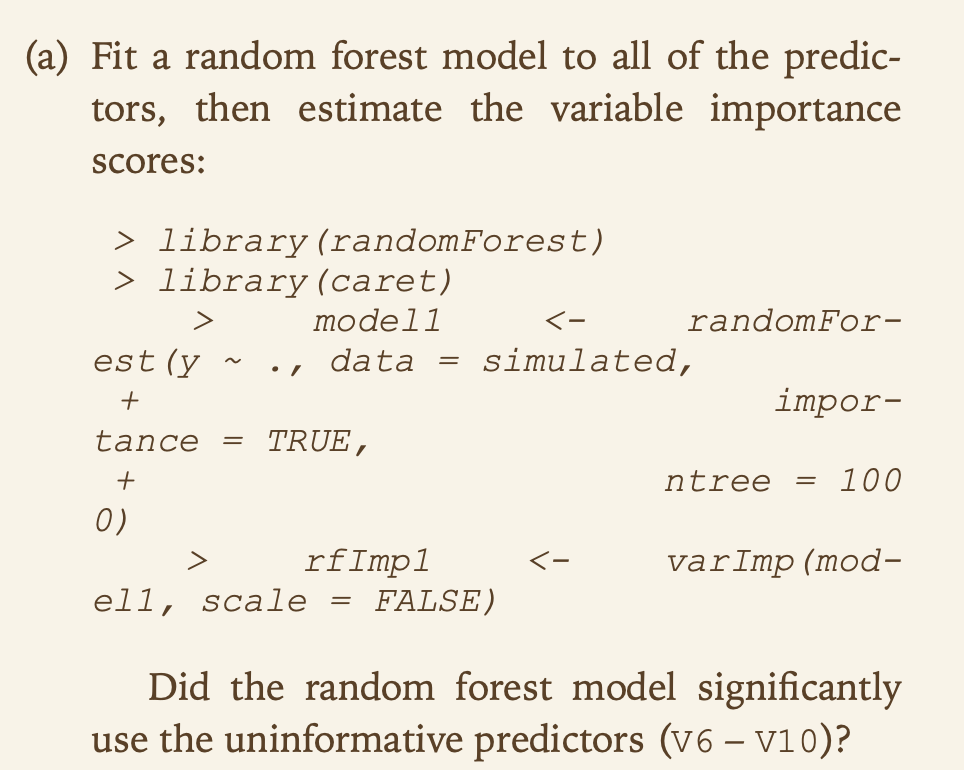
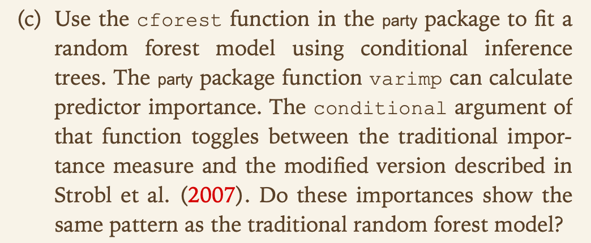
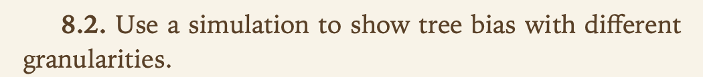
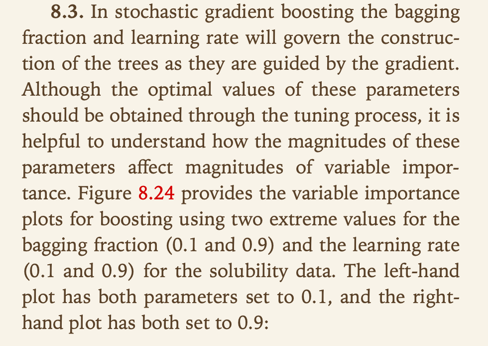
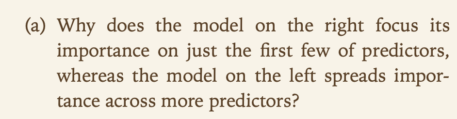
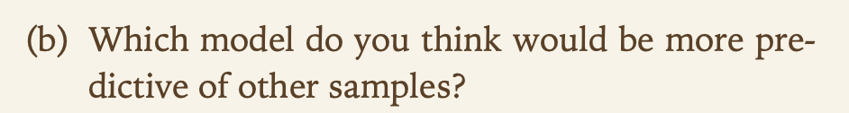
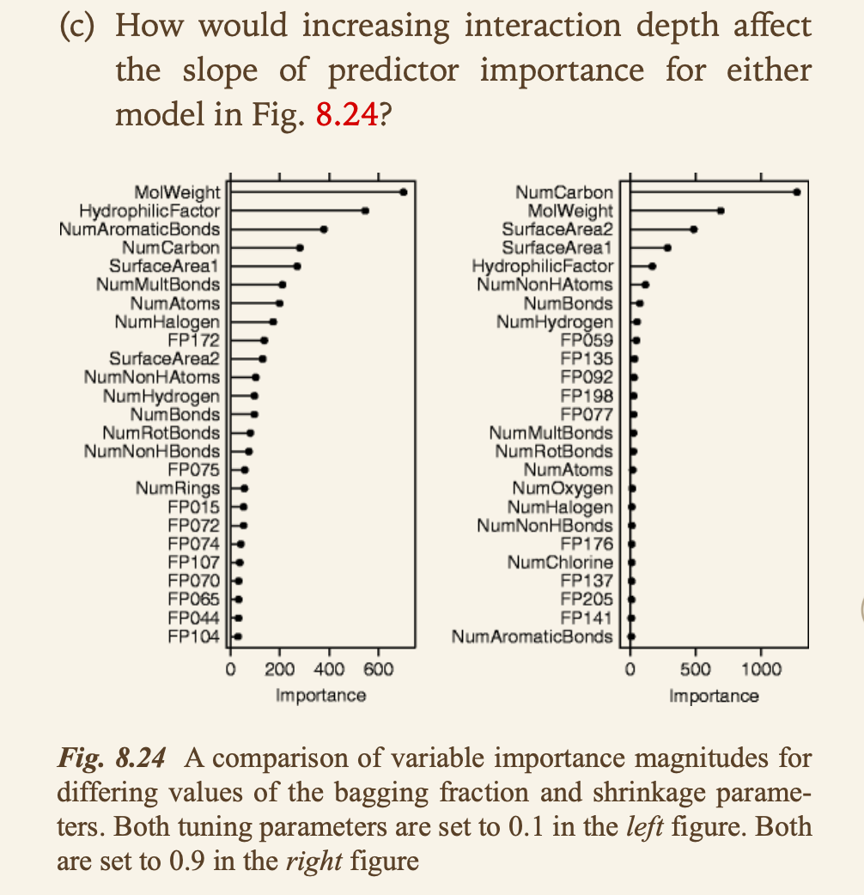
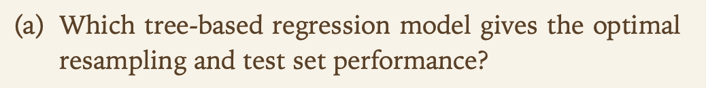
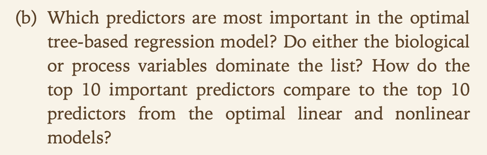
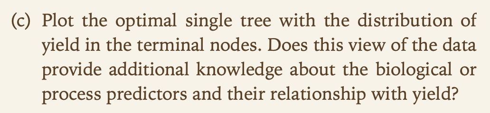

--- 
title: "Data 624 - KJ Assignments (HW2)"
author: "Group 1: Andrew Carson, Nathan Cooper, Baron Curtin, Heather Geiger"
date: "`r Sys.Date()`"
site: bookdown::bookdown_site
output: bookdown::gitbook
documentclass: book
bibliography: [book.bib, packages.bib]
biblio-style: apalike
link-citations: yes
github-repo: baroncurtin2/data624
description: "Group 1's HA Homework Assignments"
---

```{r include=FALSE}
# automatically create a bib database for R packages
knitr::write_bib(c(
  .packages(), 'bookdown', 'knitr', 'rmarkdown'
), 'packages.bib')
```

# Introduction
The work herein constitutes the work of Andrew Carson, Nathan Cooper, Baron Curtin, and Heather Geiger in the course Data 624 towards completion of the second set of homework assignments due for Professor Burk.

<!--chapter:end:index.Rmd-->

```{r, include=FALSE}
knitr::opts_chunk$set(echo = TRUE)
knitr::opts_chunk$set(tidy = TRUE)
knitr::opts_chunk$set(warning = FALSE)
libs <- c("tidyverse", "knitr", "kableExtra", "glue", "magrittr", "AppliedPredictiveModeling", "caret", "viridis")
loadPkg <- function(x) {
  if(!require(x, character.only = T)) install.packages(x, dependencies = T, repos = "http://cran.us.r-project.org")
  require(x, character.only = T)
}
lapply(libs, loadPkg)
```

# KJ6

## 6.3


### a


```{r}
data("ChemicalManufacturingProcess")
data <- ChemicalManufacturingProcess %>%
  as.data.frame()

# split dataset into predictors and yield
Xs <- data %>%
  select(-Yield)
y <- data %>%
  select(Yield)
```


### b


```{r}
missing <- sum(is.na(Xs))
missingPercent <- missing/(nrow(data) * ncol(data))
```

The `r missing` missing values corresponds to `r missingPercent %>% multiply_by(100) %>% round(2)` of all the predictor data

```{r}
missingPredictors <- Xs %>%
  gather(predictor, value) %>%
  group_by(predictor) %>%
  summarise(missing = sum(is.na(value))) %>%
  mutate(percent = (missing/sum(missing)) * 100) %>%
  filter(missing > 0) %>%
  arrange(desc(missing))

print(missingPredictors)
missingPredictors$missing[c(1:3)]
```

* All of the variables missing data describe Manufacturing Processes
* MP3, MP11, and MP10 make up `r (sum(missingPredictors$missing[c(1:3)])/sum(missingPredictors$missing)) * 100`% of the missing information

The data can be preprocessed and imputed
```{r}
library(caret)
Xs_processed <- preProcess(Xs, method = c("knnImpute", "center", "scale", "nzv", "corr"))

# apply preprocessing and imputation
Xs_trans <- predict(Xs_processed, Xs)
```

Lets just confirm the distribution of the transformed data to ensure appropriateness
```{r}
Xs_trans %>%
  gather(predictor, value) %>%
  mutate(type = ifelse(substr(predictor, 1, 1) == "B", "Biological", "Mechanical"),
         number = substr(predictor, nchar(predictor) - 1, nchar(predictor))) %>%
  ggplot(aes(x = predictor, y = value)) + 
  geom_point(aes(col = type), alpha = 0.5) +
  scale_x_discrete(NULL, labels = NULL) +
  scale_y_continuous(limits = c(-10, 10)) +
  coord_flip() +
  ggtitle("Distribution of Predictors") +
  theme(legend.position = c(1, 1), legend.justification = c(1.1, 1.1))
```

The plot confirms that the preprocessing did well

### c


```{r}
set.seed(7)
trainRows <- createDataPartition(y$Yield, p=.8, list = F)

# training sets
X_train <- Xs_trans[trainRows,]
y_train <- y[trainRows,]

# test sets
X_test <- Xs_trans[-trainRows,]
y_test <- y[-trainRows,]
```

Lets check the correlation of the values
```{r}
cor(Xs_trans) %>%
  # convert to data frame
  as.data.frame() %>%
  # change row names to variable
  rownames_to_column("predictorX") %>%
  # convert to tidy format for plotting
  gather(predictorY, cor, -predictorX) %>%
  # plot 
  ggplot(aes(predictorX, predictorY)) +
  geom_raster(aes(fill = cor)) +
  scale_x_discrete(NULL, labels = NULL) + 
  scale_y_discrete(NULL, labels = NULL) +
  viridis::scale_fill_viridis(NULL) +
  ggtitle("Correlation between predictors") +
  theme(legend.position = "bottom")
```

The correlation plot reveals that some correlation between variables still exists. We can attempt to recitfy this through the use dimensionality reduction

```{r}
set.seed(7)
cv <- trainControl(method = "cv", number = 15)

trainCV <- train(x = X_train, y = y_train, method = "pls", tuneLength = 20, trControl = cv)
```

```{r}
trainCV$results %>% 
  ggplot(aes(x = ncomp)) +
  geom_line(aes(y = RMSE, col = "RMSE")) +
  geom_line(aes(y = Rsquared, col = "R-squared")) +
  geom_line(aes(y = MAE, col = "MAE")) +
  geom_point(data = data_frame(Metric = c("RMSE", "R-squared", "MAE"),
                               ncomp = c(which.min(trainCV$results$RMSE),
                                         which.max(trainCV$results$Rsquared),
                                         which.min(trainCV$results$MAE)),
                               Optimal = c(min(trainCV$results$RMSE),
                                           max(trainCV$results$Rsquared),
                                           min(trainCV$results$MAE))),
             aes(x = ncomp, y = Optimal, col = Metric), size = 1.5) +
  scale_color_discrete("Metric", breaks = c("RMSE", "MAE", "R-squared")) +
  labs(title = "Components (Number) Accuracy",
       subtitle = "15 Fold CV Partial Least Squares",
       x = "Number of PLS components", y = NULL) +
  theme(legend.position = "bottom", legend.direction = "horizontal")
```

The optimal model, based on RMSE, uses `r which.min(trainCV$results$RMSE)` components with an RMSE value of `r min(trainCV$results$RMSE)` based on the plot above


### d


```{r}
predictions <- predict(trainCV, X_test)
yhat_performance <- defaultSummary(data.frame(obs = y_test, pred = predictions)) %T>%
  print
```

The RMSE is `r yhat_performance[1]`, which is slightly better than the RMSE on the training set


### e


```{r}
importantVars <- varImp(trainCV)

importantVars %>%
  ggplot(top = 10) + 
  ggtitle("Top 10 Predictors")
```

* 7 of the Top 10 important variables are Manufacturing
* M32 is the most important registering 100% importance


### f


```{r}
top5 <- rownames(importantVars$importance)[order(importantVars$importance$Overall, decreasing = TRUE)][1:5]

top5_df <- as.data.frame(cbind(Xs_trans, y)[, c(top5, "Yield")])

top5_df %>% 
  gather(predictor, value, -Yield) %>% 
  ggplot(aes(x = value, y = Yield)) +
  geom_point(alpha = 0.25) +
  stat_smooth(se = FALSE, method = "glm") +
  facet_wrap(~ predictor, nrow = 2, scales = "free") +
  labs(title = "Top 5 Predictor Relationships")
```

* M09, M32 have positive relationships with Yield
* M13, M17, and M36 have negative relationships with Yield
* Using this information, increasing M09 and M32 will increase Yield, while decreasing the others will also increase Yield
* The relationships between the variables need to be explored first prior to adjusting manufacturing strategy


<!--chapter:end:01-KJ6.Rmd-->

```{r, include=FALSE}
knitr::opts_chunk$set(echo = TRUE)

libs <- c('mlbench', 'caret', 'earth', 'ggplot2', 'tidyr', 'dplyr', 'AppliedPredictiveModeling', 'impute')

loadPkg <- function(x) {
  if(!require(x, character.only = T)) install.packages(x, dependencies = T, repos = "http://cran.us.r-project.org")
  require(x, character.only = T)
}
lapply(libs, loadPkg)

set.seed(200)
```

# KJ7


## 7.2


Set up training data.

```{r}
trainingData <- mlbench.friedman1(200, sd = 1)
```

Format training data.

```{r}
trainingData$x <- data.frame(trainingData$x)
```

Plot training data predictors vs. outcome.

```{r}
featurePlot(trainingData$x,trainingData$y)
```

Looks like the first five predictors have a better correlation with the outcome than the last five.

Set up and format test data.

```{r}
testData <- mlbench.friedman1(5000, sd = 1)
testData$x <- data.frame(testData$x)
```

# Instructions

Tune several models on these data.

Example of a model given was using the caret package train function with a KNN model, pre-process training data with centering and scaling, tuneLength = 10 (for KNN, this would mean trying 10 different values for k).

Then, use the models based on the training data to predict on test data. 

Which models appear to give the best performance? Does MARS select the informative predictors (those named X1–X5)?

# Answer

## Preliminary steps

Before we start creating models, let's set our own seed, separate from the one used to create the input data.

```{r}
set.seed(1392)
```

Also, write a function to look at error and R-squared of a given model applied to the test data.

```{r}
error_and_Rsquared <- function(model){
	predictions <- predict(model,newdata = testData$x)
	return(postResample(pred = predictions, obs = testData$y))
}
```

## Neural networks

Let's try the neural networks method with model averaging.

```{r avg-nnet-7.2,cache=TRUE,message=FALSE,warning=FALSE}
nnetGrid <- expand.grid(.decay = c(0, 0.01, .1),
                .size = c(1:10),
                .bag = FALSE)
averaging_nnet_model <- train(trainingData$x,trainingData$y,
                            method="avNNet",
                            tuneGrid = nnetGrid,
                            trControl = trainControl(method = "cv", number = 10),
                            preProc = c("center", "scale"),
                            linout = TRUE,
                            trace=FALSE,
                            maxit = 500)
```

## Multivariate Adaptive Regression Splines (MARS)

Use the earth command from the earth package.

```{r MARS-model-7.2,message=FALSE,warning=FALSE,cache=TRUE}
MARS_model <- earth(trainingData$x,trainingData$y)
```

Print model details.

```{r}
MARS_model
summary(MARS_model)
```

"Does MARS select the informative predictors (those named X1–X5)?"

For the most part, yes, but not entirely. The MARS model does include all five of the informative predictors (X1-X5) and excludes most of the last predictors that did not appear as correlated with outcome. However, it does also include one of the last predictors (X6).

##  Support Vector Machine (SVM)

I tried running SVM with a polynomial kernel here, but runtime was impractically long.

However, I will try running with both a linear and radial basis function kernel.

```{r SVM-linear-kernel-7.2,message=FALSE,warning=FALSE,cache=TRUE}
SVM_linear_model <- train(trainingData$x,trainingData$y,
						method="svmLinear",
						trControl = trainControl(method = "cv", number = 10),
						preProc = c("center", "scale"),
						tuneLength = 14)
```

```{r SVM-RBF-kernel-7.2,message=FALSE,warning=FALSE,cache=TRUE}
SVM_RBF_model <- train(trainingData$x,trainingData$y,
					method="svmRadial",
					trControl = trainControl(method = "cv", number = 10),
					preProc = c("center", "scale"),
					tuneLength = 14)
```

# K-Nearest Neighbors (KNN)

Let's run KNN just as it was run in the question example.

```{r knn-model-7.2,cache=TRUE}
knn_model <- train(x = trainingData$x,
                y = trainingData$y,
                method = "knn",
                preProc = c("center", "scale"),
                tuneLength = 10)
```

# Comparing models

Run function to get error and R-squared for each model.

```{r}
for(model in c("averaging_nnet_model","MARS_model","SVM_linear_model","SVM_RBF_model","knn_model"))
{
	print(model)
	print(error_and_Rsquared(get(model)))
}
```

Looks like the best model here in terms of both R-squared (aka variance explained) and RMSE/MAE (minimizing error) within the test data is MARS.

After that, the neural network with model averaging and SVM with radial basis function both perform pretty similarly, falling slightly behind MARS but still doing pretty well.

The KNN and SVM with linear kernel models perform the worst out of the five models tested. 


## 7.5


### Initial data loading

A chemical manufacturing process for a pharmaceutical product was discussed previously.

In this problem, the objective is to understand the relationship between biological measurements of the raw materials (predictors), measurements of the manufacturing process (predictors), and the response of product yield. 

Biological predictors cannot be changed but can be used to assess the quality of the raw material before processing. On the other hand, manufacturing process predictors can be changed in the manufacturing process. Improving product yield by 1 % will boost revenue by approximately one hundred thousand dollars per batch.

Load the data in R.

```{r}
data(ChemicalManufacturingProcess)
```

### Impute missing values.

A small percentage of cells in the predictor set contain missing values. We are asked to use an imputation function to fill in these missing values.

We find the following NAs in the data.

* Row 1 - Has 11 variables where this row is the only NA for that variable: manufacturing processes 1,4,5,7,8,12,22,23,24,40,41 
* Row 23 - Has 1 variable where this row is the only NA for that variable: manufacturing process 14
* Rows 172,173,174,175,176 - Have NAs in manufacturing processes 25-31,33-36 (not 32!)
* Rows 1,2,3,4,5,6,22,23,24 - Have NAs in manufacturing processes 3,10, and 11

* Manufacturing process 6 - has NA in rows 1 and 90
* Manufacturing process 2 - has NA in rows 1,134, and 139

* Manufacturing process 3 - also has NA in rows 15-20
* Manufacturing process 11 - also has NA in row 98

We also find a few outliers that I believe would be good to replace with an NA and impute. These are:

* One row (108) has a 0 for mps 25,26,27,29,30,and 31, while all other observations are significantly larger. 
* Mps 16, 18, and 20 all have one zero, while remaining values are >4000.
* Mps 22, 23, 38, 39, 42, 44 and 45 each have a handful of zeros. In most of these variables, these zeros are unusually small relative to the nonzero values. Even when this is not the case (nonzero values aren't that large), the zeroes are also recurrent within a few rows in a way that makes them seem suspect.

```{r}
for(var in paste0("ManufacturingProcess",c(16,18,20,22,23,25,26,27,29,30,31,38,39,42,44,45)))
{
    zero_indices <- which(ChemicalManufacturingProcess[,var] == 0 & is.na(ChemicalManufacturingProcess[,var]) == FALSE)
    ChemicalManufacturingProcess[zero_indices,var] <- NA
}
```

Start with impute.knn.

```{r}
ChemicalManufacturingProcess_imputed <- impute.knn(as.matrix(ChemicalManufacturingProcess),k=10,rng.seed=1392)
ChemicalManufacturingProcess_imputed <- data.frame(ChemicalManufacturingProcess_imputed$data,check.names=FALSE,stringsAsFactors=FALSE)
```

For manufacturing processes 2 and 28, they are actually bimodal, with a bunch of zeroes then continuous numeric variables that are much larger.

If the imputed value is less than the half the minimum of non-zero values, change to 0.

Also round to match previous level of precision.

```{r}
for(var in c("ManufacturingProcess02","ManufacturingProcess28"))
{
	half_min_value <- min(ChemicalManufacturingProcess[ChemicalManufacturingProcess[,var] > 0,var],na.rm=TRUE)/2
	ChemicalManufacturingProcess_imputed[which(is.na(ChemicalManufacturingProcess[,var]) == TRUE & ChemicalManufacturingProcess_imputed[,var] < half_min_value),var] <- 0
	ChemicalManufacturingProcess_imputed[,var] <- round(ChemicalManufacturingProcess_imputed[,var],digits=1)
}
```

For remaining variables, imputed values from impute.knn looked good. Just round to the appropriate level of precision within the imputed values.

```{r}
NAs_per_var <- as.numeric(as.vector(apply(ChemicalManufacturingProcess,2,function(x)length(which(is.na(x) == TRUE)))))
vars_with_NAs <- colnames(ChemicalManufacturingProcess)[NAs_per_var > 0]
vars_with_NAs <- setdiff(vars_with_NAs,c("ManufacturingProcess02","ManufacturingProcess28"))
vars_with_NAs <- setdiff(vars_with_NAs,paste0("ManufacturingProcess",c(16,18,20,38,39,42,44,45))) #Initially did not include these variables when manually calculated appropriate precision. Will round these in a separate loop.
digits_precision <- c(1,2,0,1,1,0,0,1,1,rep(0,times=8),1,1,1,0,1,0,3,1,2)
```

```{r,echo=TRUE,eval=TRUE}
for(i in 1:length(vars_with_NAs))
{
	var = vars_with_NAs[i]
	digits = digits_precision[i]
	ChemicalManufacturingProcess_imputed[,var] <- round(ChemicalManufacturingProcess_imputed[,var],digits=digits)
}
```	

```{r}
vars_with_NAs <- paste0("ManufacturingProcess",c(16,18,20,38,39,42,44,45))
digits_precision <- c(0,0,0,0,1,1,1,1)
for(i in 1:length(vars_with_NAs))
{
    var = vars_with_NAs[i]
    digits = digits_precision[i]
    ChemicalManufacturingProcess_imputed[,var] <- round(ChemicalManufacturingProcess_imputed[,var],digits=digits)
}
```

### Data exploration and additional manual transformation

Look at distribution of yield.

```{r,fig.width=6,fig.height=6}
hist(ChemicalManufacturingProcess_imputed$Yield,labels=TRUE,xlab="",ylab="Observations",main="Yield")
```

And of biological variables.

```{r,fig.width=10,fig.height=6}
par(mfrow=c(3,4))
for(i in 2:13)
{
    hist(ChemicalManufacturingProcess_imputed[,i],
        xlab="",ylab="Observations",main=colnames(ChemicalManufacturingProcess_imputed)[i],labels=TRUE)
}
```

All except 7 look like standard continuous variables, whether normally distributed or skewed.

For BiologicalMaterial07, there are actually 173 observations with 100 and 3 with 100.83, no in between. 

Convert to binary where 0 = 100 and 1 = 100.83.

```{r}
ChemicalManufacturingProcess[,"BiologicalMaterial07"] <- ifelse(ChemicalManufacturingProcess[,"BiologicalMaterial07"] > 100,1,0)
```

Now, on to manufacturing processes.

```{r}
mps_data <- ChemicalManufacturingProcess_imputed[,14:ncol(ChemicalManufacturingProcess)]
unique_per_mp <- apply(mps_data,2,function(x)length(unique(x)))
mps_data_for_barplots <- mps_data[,unique_per_mp < 12]
mps_data_for_histograms <- mps_data[,unique_per_mp >= 14]
mps_data_barplot_nonpanel <- as.numeric(as.vector(mps_data[,unique_per_mp == 12]))
```

```{r,fig.width=10,fig.height=6}
par(mfrow=c(3,4))
for(i in 1:ncol(mps_data_for_barplots))
{
    mps_data_for_barplots[,i] <- factor(mps_data_for_barplots[,i],levels=unique(mps_data_for_barplots[,i])[order(unique(mps_data_for_barplots[,i]))])
    barplot(table(mps_data_for_barplots[,i]),ylab="Observations",main=colnames(mps_data_for_barplots)[i])
}
```

```{r,fig.width=6,fig.height=6}
barplot(table(mps_data_barplot_nonpanel),ylab="Observations",main=colnames(mps_data)[unique_per_mp == 12])
```

We find a few variables that should be converted to binary.

We also have a few (e.g. mp 23) that may actually be counts vs. continuous, but we can still treat them the same as we would a numeric variable.

Don't think we need to worry about special transformation on the ones with more than two unique values.

```{r,fig.width=10,fig.height=12}
par(mfrow=c(8,4))
for(i in 1:ncol(mps_data_for_histograms))
{
    hist(mps_data_for_histograms[,i],
        xlab="",ylab="Obs",main=colnames(mps_data_for_histograms)[i],labels=TRUE)
}
```

As mentioned earlier, mps 2 and 28 have a bunch of zeroes, then larger values.

Looks like we probably should have also done the 0 to NA then impute for mp 1 earlier. We should do that now along with converting select variables to binary.

All other variables appear to be standard numeric variables with various degrees of skew.

```{r}
formerly_zero <- which(ChemicalManufacturingProcess_imputed[,"ManufacturingProcess01"] == 0)
ChemicalManufacturingProcess_imputed[formerly_zero,"ManufacturingProcess01"] <- NA
ChemicalManufacturingProcess_imputed <- impute.knn(as.matrix(ChemicalManufacturingProcess_imputed),k=10,rng.seed=1392)
ChemicalManufacturingProcess_imputed <- data.frame(ChemicalManufacturingProcess_imputed$data,check.names=FALSE,stringsAsFactors=FALSE)
ChemicalManufacturingProcess_imputed[,"ManufacturingProcess01"] <- round(ChemicalManufacturingProcess_imputed[,"ManufacturingProcess01"],digits=1)
```

```{r}
unique_values_per_var <- apply(ChemicalManufacturingProcess_imputed,2,function(x)length(unique(x)))
for(var in which(unique_values_per_var == 2))
{
    ChemicalManufacturingProcess_imputed[,var] <- ifelse(ChemicalManufacturingProcess_imputed[,var] == min(ChemicalManufacturingProcess_imputed[,var]),0,1)
}
```

### Automated data transformation and redo exploration

Let's move on to cleaning up in a more automated way using the preProcess function.

Then, I will show code to explore the now-transformed values. Not running this to avoid this becoming too long, but I checked and transformations looked reasonable.

```{r}
ChemicalManufacturingProcess_predictors_imputed_not_cleaned <- ChemicalManufacturingProcess_imputed[,2:ncol(ChemicalManufacturingProcess_imputed)]
preProcess_params <- preProcess(ChemicalManufacturingProcess_predictors_imputed_not_cleaned,
                                method=c("BoxCox","center","scale"))
ChemicalManufacturingProcess_predictors_imputed_cleaned <- predict(preProcess_params,ChemicalManufacturingProcess_predictors_imputed_not_cleaned)
```

```{r,fig.width=10,fig.height=6,echo=TRUE,eval=FALSE}
par(mfrow=c(3,4))
for(i in 1:12)
{
hist(ChemicalManufacturingProcess_predictors_imputed_cleaned[,i],        
    xlab="",ylab="Observations",main=colnames(ChemicalManufacturingProcess_predictors_imputed_cleaned)[i],labels=TRUE)
}
```

```{r,fig.width=10,fig.height=6,echo=TRUE,eval=FALSE}
par(mfrow=c(3,4))
for(i in 1:12)
{
plot(ChemicalManufacturingProcess_predictors_imputed_not_cleaned[,i],
    ChemicalManufacturingProcess_predictors_imputed_cleaned[,i],
    xlab="Before",
    ylab="After",
    main=colnames(ChemicalManufacturingProcess_predictors_imputed_cleaned)[i])
}
```

```{r,fig.width=10,fig.height=16,echo=TRUE,eval=FALSE}
par(mfrow=c(9,5))
for(i in 13:ncol(ChemicalManufacturingProcess_predictors_imputed_cleaned))
{
hist(ChemicalManufacturingProcess_predictors_imputed_cleaned[,i],
    xlab="",ylab="Obs",main=colnames(ChemicalManufacturingProcess_predictors_imputed_cleaned)[i],labels=TRUE)
}
```

```{r,fig.width=10,fig.height=16,echo=TRUE,eval=FALSE}
par(mfrow=c(9,5))
for(i in 13:ncol(ChemicalManufacturingProcess_predictors_imputed_cleaned))
{
plot(ChemicalManufacturingProcess_predictors_imputed_not_cleaned[,i],
    ChemicalManufacturingProcess_predictors_imputed_cleaned[,i],
    xlab="Before",
    ylab="After",
    main=colnames(ChemicalManufacturingProcess_predictors_imputed_cleaned)[i])
}
```

### Training-test split

Now we just need to split the data into an 80-20 training-test split.

```{r}
set.seed(1392)
trainIndex <- createDataPartition(ChemicalManufacturingProcess$Yield,p=.8,list = FALSE,times=1)
ChemicalManufacturingProcess_transformed <- data.frame(Yield = ChemicalManufacturingProcess$Yield,ChemicalManufacturingProcess_predictors_imputed_cleaned,stringsAsFactors=FALSE)
trainingData <- ChemicalManufacturingProcess_transformed[trainIndex,]
testData <- ChemicalManufacturingProcess_transformed[-trainIndex,]
trainingData <- list(x = trainingData[,2:ncol(trainingData)],y = trainingData$Yield)
testData <- list(x = testData[,2:ncol(testData)],y = testData$Yield)
```

### Building models

Set seed before we run all these models.

```{r}
set.seed(1392)
```

#### Linear model

```{r}
linear_model <- step(lm(Yield ~ .,data=data.frame(Yield = trainingData$y,trainingData$x)),trace=FALSE)
```

#### Neural networks

Let's try the neural networks method with model averaging.

```{r avg-nnet-7.5,cache=TRUE,message=FALSE,warning=FALSE}
nnetGrid <- expand.grid(.decay = c(0, 0.01, .1),
                .size = c(1:10),
                .bag = FALSE)
averaging_nnet_model <- train(trainingData$x,trainingData$y,
                            method="avNNet",
                            tuneGrid = nnetGrid,
                            trControl = trainControl(method = "cv", number = 10),
                            preProc = c("center", "scale"),
                            linout = TRUE,
                            trace=FALSE,
                            maxit = 500)
```

#### Multivariate Adaptive Regression Splines (MARS)

Use the earth command from the earth package.

```{r MARS-model-7.5,message=FALSE,warning=FALSE,cache=TRUE}
MARS_model <- earth(trainingData$x,trainingData$y)
```

#### Support Vector Machine (SVM)

I tried running SVM with a polynomial kernel here, but runtime was impractically long.

However, I will try running with both a linear and radial basis function kernel.

```{r SVM-linear-kernel-7.5,message=FALSE,warning=FALSE,cache=TRUE}
SVM_linear_model <- train(trainingData$x,trainingData$y,
                        method="svmLinear",
                        trControl = trainControl(method = "cv", number = 10),
                        preProc = c("center", "scale"),
                        tuneLength = 14)
```

```{r SVM-RBF-kernel-7.5,message=FALSE,warning=FALSE,cache=TRUE}
SVM_RBF_model <- train(trainingData$x,trainingData$y,
                    method="svmRadial",
                    trControl = trainControl(method = "cv", number = 10),
                    preProc = c("center", "scale"),
                    tuneLength = 14)
```

#### K-Nearest Neighbors (KNN)

Let's run KNN just as it was run in the question example for 7.2.

```{r knn-model-7.5,cache=TRUE}
knn_model <- train(x = trainingData$x,
                y = trainingData$y,
                method = "knn",
                preProc = c("center", "scale"),
                tuneLength = 10)
```


### a


#### Comparing nonlinear models

Use the function to look at error and R-squared of a given model applied to the test data.

```{r}
error_and_Rsquared <- function(model){
    predictions <- predict(model,newdata = testData$x)
    return(postResample(pred = predictions, obs = testData$y))
}
```

Also add a function to get error and Rsquared running model on training data.

```{r}
error_and_Rsquared_train <- function(model){
    predictions <- predict(model,newdata = trainingData$x)
    return(postResample(pred = predictions, obs = trainingData$y))
}
```

Run function to get error and R-squared for each model on test data.

```{r}
for(model in c("averaging_nnet_model","MARS_model","SVM_linear_model","SVM_RBF_model","knn_model"))
{
    print(model)
    print(error_and_Rsquared(get(model)))
}
```

```{r}
for(model in c("averaging_nnet_model","MARS_model","SVM_linear_model","SVM_RBF_model","knn_model"))
{
    print(model)
    print(error_and_Rsquared_train(get(model)))
}
```

Looks like SVM with radial basis function kernel performs the best on both training and test data.


### b


#### Comparing nonlinear vs. linear model

Let's look in more detail at the optimal nonlinear model.

```{r}
varImp_nonlinear <- varImp(SVM_RBF_model,scale=TRUE)
top10 <- rownames(varImp_nonlinear$importance)[order(varImp_nonlinear$importance$Overall,decreasing=TRUE)[1:10]]
top10[order(top10)]
top10_nonlinear <- top10
```

And the linear model.

```{r}
varImp_linear <- varImp(linear_model,scale=TRUE)
top10 <- rownames(varImp_linear)[order(varImp_linear$Overall,decreasing=TRUE)[1:10]]
top10[order(top10)]
top10_linear <- top10
```

The optimal nonlinear model includes 4 biological variables in the top 10 most important (2,3,6,and 12).

Manufacturing process variables in the top 10 in nonlinear are 9,13,17,31,32, and 36.

The linear model top predictors are all manufacturing processes, no biological materials!

Manufacturing process variables 9, 31, and 36 are also unique as top variables in the nonlinear model.


### c


Let's check out why this might be.

```{r,fig.width=10,fig.height=6}
unique_to_nonlinear <- setdiff(top10_nonlinear,top10_linear)
par(mfrow=c(2,4))
for(var in unique_to_nonlinear)
{
	plot(trainingData$x[,var],trainingData$y,
		xlab="Variable",ylab="Yield",main=var)
}
```

At least some of these look like they might be correlated to yield better by a curve vs. a straight line. So it makes sense that they weren't important to (or maybe even selected at all for) by the linear model.


<!--chapter:end:02-KJ7.Rmd-->

```{r, include=FALSE}
knitr::opts_chunk$set(echo = TRUE)

libs <- c('AppliedPredictiveModeling', 'tidyverse', 'rpart', 'rpart.plot', 'DMwR', 'PerformanceAnalytics')

loadPkg <- function(x) {
  if(!require(x, character.only = T)) install.packages(x, dependencies = T, repos = "http://cran.us.r-project.org")
  require(x, character.only = T)
}
lapply(libs, loadPkg)

dev.new(width = 1280, height = 768 ,units = 'px')
data(ChemicalManufacturingProcess)
```

# KJ8


## 8.1


### a


```{r, echo=TRUE, eval=FALSE}
#Variable Importance
#V1	8.68958074			
#V2	6.42965064			
#V3	0.74711329			
#V4	7.68699457			
#V5	2.36904769			
#V6	0.10997268			
#V7	0.03083254			
#V8	-0.10779418			
#V9	-0.12814111			
#V10	0.04895944
```

Answer:

No, it didn't. Variables 1-5 all had greater importance than variables 6-10, and consequently, would not have been used significantly in the model.  Variables 8 and 9 have negative importance, which is really bad, as these are not helpful at all, and would be hurtful in fact towards having predictive value.  A random variable would be better than these.


### b


Answer:

Yes, the importance score drops from 8.69 to 6.02.  The loss of V1 from the model is no longer as important as it was previously since there is another variable (duplicate1) that contains roughly the same information in it.  Consequently, V1 is not as important.

```{r, echo=TRUE, eval=FALSE}
#fit new model
model2 <- randomForest(y ~ ., data = simulated,
                       importance = TRUE,
                       ntree = 1000)
#importance
rfImp2 <- varImp(model2, scale = FALSE)

#V1	6.02363848			
#V2	6.19154188			
#V3	0.55277883			
#V4	6.92793183			
#V5	2.17101110			
#V6	0.15369922			
#V7	0.10720626			
#V8	0.00929209			
#V9	-0.05010858			
#V10	0.03861636

```

When you add another predictor that is also highly correlated with V1, the variable importance drops even further, from 6.02 down to 4.75.  V1 is essentially sharing its importance with the highly correlated duplicate variables, and so it is no longer as important.

```{r, eval=FALSE, echo=TRUE}
#new predictor
simulated$duplicate2 <- simulated$V1 + rnorm(200)* .1
cor(simulated$duplicate2, simulated$V1)
#0.9430605

#new model
model3 <- randomForest(y ~ ., data = simulated,
                       importance = TRUE,
                       ntree = 1000)
#importance
rfImp3 <- varImp(model3, scale = FALSE)

#V1	4.750274828			
#V2	6.392645096			
#V3	0.546932231			
#V4	6.694197135			
#V5	2.354901393			
#V6	0.178559997			
#V7	0.003137176			
#V8	-0.067194296			
#V9	-0.088150851			
#V10	-0.040809537	

```


### c



Answer:

Using just the original values in simulated (V1-v10, not duplicate1 or duplicate 2), the variable importances are:

  * rfImp1: 1, 4, 2, 5, 3, 6, 10, 7, 8, 9
  * cfImp1: 1, 4, 2, 5, 7, 3, 6, 9, 10, 8
  * cfImp1_con: 4, 1, 2, 5, 3, 6, 7, 9, 10, 8
  
They are almost the same in the ordering.  1, 4, 2, 5 are always in the top 4, and 1 and 4 are always in the top 2.  V3 switches with 7 in the cforest cond = False model, but is really close in the magnitude of the importance.

The magnitudes are very similar between rfImp1 (9, 8, 6, 2 rounded) and cfImp1 (9, 8, 7, 2 rounded) for the first four variables.  The conditional is a little bit different and the variable importance is less spread out (7, 6, 5, 2 rounded), but not too different.  

In short, I'd say that they generally show the same pattern as the traditional random forest model for the original simulated data.

```{r, eval=FALSE, echo=TRUE}
library(party)

#cforest
model1_cf <- cforest(y ~ ., data = simulated[,1:11],
                       control = cforest_unbiased(ntree = 1000)
                       )

#conditional and regular importance
cfImp1 <-data.frame(varimp(model1_cf, conditional = FALSE))
cfImp1_con <-data.frame(varimp(model1_cf, conditional = TRUE))


```

If we include duplicate1, the variable importance order is:

  * rfImp2: 4, 2, 1, duplicate1, 5, 3, 6, 7, 10, 8, 9
  * cfImp2: 4, 1, 2, duplicate1, 5, 3, 7, 6, 10, 9, 8
  * cfImp2_con: 4, 2, 1, 5, duplicate1, 3, 6, 10, 7, 8, 9
  
These are all roughly the same as 4, 2, 1 always take the top 3, duplicate1, 5, 3 take the next 3, and 6-10 take the rest.  The magnitudes are also similar as before (rounded):

  * rfImp2: 7, 6, 6, 3, 2, ...
  * cfImp2: 8, 7, 6, 2, 2, ...
  * cfImp2_con: 6, 5, 3, 1, 1, ...

Again, this matches the pattern of the original simulated data.

```{r,eval=FALSE, echo=TRUE}
#cforest model 2
model2_cf <- cforest(y ~ ., data = simulated[,1:12],
                       control = cforest_unbiased(ntree = 1000)
                      )

#importance
cfImp2 <-data.frame(varimp(model2_cf, conditional = FALSE))
cfImp2_con <-data.frame(varimp(model2_cf, conditional = TRUE))

```

Finally, if we add duplicate2 as well, the order is:

  * rfImp3: 4, 2, 1, duplicate2, duplicate1, 5, 3, 6, 7, 10, 8, 9
  * cfImp3: 4, 2, 1, duplicate2, 5, duplicate1, 7, 3, 6, 9, 10, 8
  * cfImp3_con: 4, 2, 1, 5, duplicate2, duplicate1, 3, 7, 6, 9, 8, 10
  
In magnitude:

  * rfImp3: 7, 6, 5, 3, 3, ...
  * cfImp3: 7, 6, 5, 3, 2, ...
  * cfImp3_con: 6, 4, 2, 1, 1, ...
  
This again generally matches the pattern.


```{r, eval=FALSE, echo=TRUE}
#cforest model 3
model3_cf <- cforest(y ~ ., data = simulated[,1:13],
                       control = cforest_unbiased(ntree = 1000)
                       )

#importance 3
cfImp3 <-data.frame(varimp(model3_cf, conditional = FALSE))
cfImp3_con <-data.frame(varimp(model3_cf, conditional = TRUE))

```

Even with the duplicated data, the variable importance, both in magnitude and in ordering, seems to show the same pattern as the traditional random forest model.


### d


Answer:

With the gbm using 1000 trees, the variable importance generally matches the ordering, although the magnitude is on a different scale. Variables 1-5 are in the top 5 (where 4 and 1 are the top 2), and variables 6-10 are the bottom 5.  The same holds true with the duplicated data.

  * gbmImp1: 4, 1, 2, 5, 3, 7, 6, 9, 10, 8
  * gbmImp2: 4, 2, 1, 5, 3, duplicate1, 7, 6, 8, 9, 10
  * gbmImp3: 4, 2, 1, 5, 3, duplicate1, duplicate2,  7, 6, 8, 9, 10

```{r, eval=FALSE, echo=TRUE}
#gbm
library(gbm)

#boosted 1
model1_gbm <- gbm(y~ ., data = simulated[,1:11], 
                  distribution = "gaussian" #squared error
                  ,n.trees = 1000)

gbmImp1 <-varImp(model1_gbm, scale = FALSE, numTrees = 1000)

#boosted 2
model2_gbm <- gbm(y~ ., data = simulated[,1:12], 
                  distribution = "gaussian" #squared error
                  ,n.trees = 1000)

gbmImp2 <-varImp(model2_gbm, scale = FALSE, numTrees = 1000)

#boosted 3
model3_gbm <- gbm(y~ ., data = simulated[,1:13], 
                  distribution = "gaussian" #squared error
                  ,n.trees = 1000)

gbmImp3 <-varImp(model3_gbm, scale = FALSE, numTrees = 1000)

```

With the cubist model using 100 committees:

  * cubistImp1: 1, 2, 4, 3, 5, 6, 7, 8, 9, 10
  * cubistImp2: 1, 2, 4, 3, 5, 6, 7, 8, 9, 10, duplicate1
  * cubistImp3: 1, 2, 3, 4, 5, 6, duplicate2, duplicate1, 8, 7, 9, 10
  
The ordering is a little bit different from previous models.  1, 2, 4 are still the most important variables, but 4 is no longer trading off with 1 for most important variable, as 2 is considered more important.  Still, variables 1-5 are in the top 5 while 6-10 are in the bottom 5.  The duplicate values are mostly ignored.


```{r, eval=FALSE, echo=TRUE}
#cubist
library(Cubist)

#cubist 1
model1_cubist <-cubist(x = simulated[,c(1:10)], y = simulated[,11], committees = 100)
cubistImp1 <- varImp(model1_cubist)

#cubist 2
model2_cubist <-cubist(x = simulated[,c(1:10,12)], y = simulated[,11], committees = 100)
cubistImp2 <- varImp(model2_cubist)

#cubist 3
model3_cubist <-cubist(x = simulated[,c(1:10, 12, 13)], y = simulated[,11], committees = 100)
cubistImp3 <- varImp(model3_cubist)

```

Generally speaking, the variable importance is the same across these different kinds of tree models.  There are some differences, but these appear to be relatively minor.  The models all agree that variables 4, 2, and 1 are the most important, 5 and 3 are next, and then 6-10 follow.  

The biggest difference is that randomForest, cforest, and gbm all tend to rank the duplicate values as being relatively important after the first 5 variables, whereas the cubist model appears to ignore these for the most part.  This may be due to how the cubist model handles covariance.


## 8.2



Answer: 

Tree bias refers to the fact that "predictors with a higher number of distinct values are favored over more granular predictors" (KJ 182).  Kuhn and Johnson quote other authors that describe a scenario when this can occur:

  * the data set has a mix of informative and noise variables
  * the noise variables have more splits than the informative variables
  * the noise variables then split the top nodes of the tree
  
Or put differently here (https://www.r-project.org/conferences/useR-2006/Abstracts/Strobl+Zeileis+Boulesteix+Hothorn.pdf):

  * "When potential predictor variables vary in their number of categories, and thus in their number of potential cutpoints, those variables that provide more potential cutpoints are more likely to be selected by chance" (1).

The below code recreates this scenario.  A y vector of 100 uniformly random values is created.  Then 18 variables are created based on y, using an increasing number of cuts (from 3 to 20) in the data to generate successively more breakpoints.  Noise is also added to each variable to make sure that it correlates less with y than the previous variable.  For example, here is the correlation between y and each variable below:

          y    x_cut3    x_cut4    x_cut5    x_cut6    x_cut7    x_cut8    x_cut9 
    1.0000000 0.9460066 0.9456638 0.9247502 0.9173373 0.9034732 0.8950539 0.8838463 

    x_cut10   x_cut11   x_cut12   x_cut13   x_cut14   x_cut15   x_cut16   x_cut17 
    0.8361560 0.8292382 0.8242503 0.8238068 0.8164344 0.7971259 0.7966548 0.7737809 

    x_cut18   x_cut19   x_cut20 
    0.7586791 0.7344495 0.6945186 

Once the variables are created, making sure that as the cuts increase the correlation with y decreases, then a tree is created.  The top variable according to variable importance is then recorded.  Doing the above 500 times produced a distribution of what variable was considered to be the most important according to the tree splitting.

The most important variable was cut 4.  While slightly less correlated with y than cut 3, it was the most important variable 314 times, while cut 3 was only the top variable 73 times.  Cuts 5 and 6 combined to have more variable importance occurrences (31 + 45 = 76) than cut 3 alone.  Even cuts 7, 8, 9, 10, 11, 13, and 15 were most important at least once.  This despite many of these variables being much less correlated with y than cut 3.  See full table below, sorted by the number of times a variable was considered the most important:


    x_cut4  x_cut3  x_cut6  x_cut5  x_cut7  x_cut8 x_cut10  x_cut9 x_cut11 x_cut15 
        314      73      45      31      13       9       7       3       2       2 
    x_cut13 
          1 
      
Thus, it does seem that trees have a tendency to select variables that, though not as informative with respect to the y value being predicted, have more cutpoints and hence are deemed to be more important in the tree model.

```{r, echo = TRUE, eval=FALSE}
library(rpart)
library(stringr)

#create empty variable importance vector
varImpVector <- c()

for(j in 1:500){
  
  #start df and generate random y values
  y <- runif(100, 0, 100)
  df_8.2 <- data.frame(y)
  
  cutNoise <- function(y, cuts, noise){
  
    #get cuts and add noise
    x <- as.character(cut(y + runif(100,0,noise), cuts))
    x_adj <-as.numeric(substring(x, 2, str_locate(x,",")[,1]-1))
    
    #round
    x_final <- round(x_adj)
    
    return(x_final)
  }
  
  for(i in 3:20){
    
    
    #initialize variables
    noise <- 0
    if (i == 3){
      x_temp<-cutNoise(y,i, noise)
      cor <- 1
    }
    
    
    #add noise until correlation is less than previous variable
    while (cor <= cor(y,x_temp)){
      noise <- noise + 1
      x_temp<-cutNoise(y,i, noise)
    }
    
    #get new baseline correlation
    cor <- cor(y,x_temp)
    
    #add to df
    name_temp <- paste0("x_cut",i)
    df_8.2$temp <-x_temp
    names(df_8.2)[names(df_8.2)=="temp"] <- name_temp
    
  }
  
  #sort(cor(df_8.2)[,1], decreasing = TRUE)
  
  #create tree
  tree <-rpart(y ~ ., data = df_8.2 )
  
  #get top variable importance and add to vector
  varImpVector<-c(varImpVector, names(tree$variable.importance)[1])
  
}

#get counts of most important variable
table(varImpVector)[order(table(varImpVector), decreasing=TRUE)]
```


## 8.3



### a


Trees tend to form retangular regions in the vector space formed by the predictor values (figure 8.1, page 174). By setting the bagging fraction and the learning rate to 0.9 you have affectively increased the areas formed by the model for the most important predictors. This is becuase you are adding a larger fraction of the previous iteration's prediction to the current interation's prediction. This will tend to bias toward the most influential predictors. 


### b


Setting the learning fraction too high would tend to under-fit the model, leading to high bias in the bias-varaince balance. A learing rate of less than 0.01 is considered optimal (page 206), so the learning rate of 0.1 would make a more predictive model.


### c


Increasing depth would decrease the slope of predcitor importance. A increased depth would have more possible outcomes, and with more possible predictions the iterative loop would progress more slowly. That is to say that each outcome's effect would be lesser and the model would tend to a stable outcome over more iterations. The overall effect being an increase in the number of predictor importance which would mean that the slope of the predcitor importance would go down.


## 8.7


The matrix processPredictors contains the 57 predictors (12 describingthe input biological material and 45 describing the process predictors) for the 176 manufacturing runs. yield contains the percent yield for each run.

```{r}
# removes outliers  https://stackoverflow.com/questions/4787332/how-to-remove-outliers-from-a-dataset
ChemicalManufacturingProcess <- ChemicalManufacturingProcess[!ChemicalManufacturingProcess %in% boxplot.stats(ChemicalManufacturingProcess)$out]
# replace missing values and outliers with a KNN imputation
ChemicalManufacturingProcess <- ChemicalManufacturingProcess %>% knnImputation(k=5)
ChemicalManufacturingProcess %>% summary()
```

```{r, dat_viz, eval=TRUE}
ChemicalManufacturingProcess[,2:12]%>% chart.Correlation()
ChemicalManufacturingProcess[,13:23]%>% chart.Correlation()
ChemicalManufacturingProcess[,24:34]%>% chart.Correlation()
ChemicalManufacturingProcess[,35:45]%>% chart.Correlation()
ChemicalManufacturingProcess[,46:58] %>% chart.Correlation()
```


```{r center-scale, eval=TRUE}
# rescale the data for the PLS
ChemicalManufacturingProcess <- ChemicalManufacturingProcess %>% mutate_all(funs(scale))
ChemicalManufacturingProcess[,2:12]%>% chart.Correlation()
ChemicalManufacturingProcess[,13:23]%>% chart.Correlation()
ChemicalManufacturingProcess[,24:34]%>% chart.Correlation()
ChemicalManufacturingProcess[,35:45]%>% chart.Correlation()
ChemicalManufacturingProcess[,46:58] %>% chart.Correlation()
```

```{r, rand_tree, eval=TRUE}
# Now I will use a 5x Cross Validation 
smp_size <- floor(0.75 * nrow(ChemicalManufacturingProcess))
library(Metrics)
## set the seed to make your partition reproducible
for(i in c(40:44)){
  set.seed(i)
  train_ind <- sample(seq_len(nrow(ChemicalManufacturingProcess)), size = smp_size)

  train <- ChemicalManufacturingProcess[train_ind,]
  test <- ChemicalManufacturingProcess[-train_ind,]
  x = train[,2:58]
  anv <- rpart(
  formula = Yield ~ .,
  data    = train,
  method  = "anova"
  )
  anv %>% print()
  plotcp(anv)
  rpart.plot(anv)
  pred<- predict(object = anv, newdata = test)
  rmse(test$Yield,pred) %>% print()
}
```

```{r, rand_tree_cp_opt, eval=TRUE}
# Now I will use a 5x Cross Validation 
smp_size <- floor(0.75 * nrow(ChemicalManufacturingProcess))
library(Metrics)
## set the seed to make your partition reproducible
for(i in c(40:44)){
  set.seed(i)
  train_ind <- sample(seq_len(nrow(ChemicalManufacturingProcess)), size = smp_size)

  train <- ChemicalManufacturingProcess[train_ind,]
  test <- ChemicalManufacturingProcess[-train_ind,]
  anv <- rpart(
  formula = Yield ~ .,
  data    = train,
  method  = "anova"
  )
  #from datacamp https://campus.datacamp.com/courses/machine-learning-with-tree-based-models-in-r/regression-trees
  opt_index <- which.min(anv$cptable[, "xerror"])
  cp_opt <- anv$cptable[opt_index, "CP"]
  anv_opt <- prune(tree = anv, cp = cp_opt)
  rpart.plot(anv_opt)
  pred<- predict(object = anv_opt, newdata = test)
  i %>% print()
  cp_opt %>% print()
  rmse(test$Yield,pred) %>% print()
}
```

```{r, rand_tree_grid_search, eval=TRUE}
# Now I will use a 5x Cross Validation 
smp_size <- floor(0.75 * nrow(ChemicalManufacturingProcess))
library(Metrics)
## set the seed to make your partition reproducible
minsplit <- seq(1,15,1)
maxdepth <- seq(1,15,1)

hyper_grid <- expand.grid(minsplit = minsplit, maxdepth = maxdepth)
cp_opt <- 0.02279032 #for seed 42
num_models <- nrow(hyper_grid)
set.seed(42)
train_ind <- sample(seq_len(nrow(ChemicalManufacturingProcess)), size = smp_size)

train <- ChemicalManufacturingProcess[train_ind,]
test <- ChemicalManufacturingProcess[-train_ind,]

rmse_values <- c()
anvs <- list()
for(i in c(1:num_models)){
  # Get minsplit, maxdepth values at row i
  minsplit <- hyper_grid$minsplit[i]
  maxdepth <- hyper_grid$maxdepth[i]

  # Train a model and store in the list
  anvs[[i]] <- rpart(formula = Yield ~ ., 
                              data = train, 
                              method = "anova",
                              cp= cp_opt,
                              minsplit = minsplit,
                              maxdepth = maxdepth)
  anv <- anvs[[i]]
  pred <- predict(object = anv,
                  newdata = test)
  #from datacamp https://campus.datacamp.com/courses/machine-learning-with-tree-based-models-in-r/regression-trees
  rmse_values[i] = rmse(test$Yield, pred)
}

# Identify the model with smallest validation set RMSE
best_model <- anvs[[which.min(rmse_values)]]

# Print the model paramters of the best model
best_model$control
```


### a


Performing a grid search on the best hyper-parameters yeilds a tree regression with a max depth of 1 and a minimum split of 2 with a cp of 0.02279032. This is a very simplistic model. We wonder if the pre-processing that we were told to maintain from 6.3 was not optimal for this model leading to under-fitting the model.


### b


```{r}
best_model %>% print()
rmse_values[which.min(rmse_values)] %>% print()
```

We see that ManufacturingProcess32 is the most important. That the max depth is limited to 1 this is the only predictor. That said, when we used the default values to constrain cp, the 


### c



```{r}
rpart.plot(best_model)
```

Again constrained to max depth 1 this is a very simple plot. The model assigns a yeild of -0.51 if Manufacturing Process 32 is less than 0.19 and 0.73 if greater than 0.19. This results in an RMSE of 0.6278685. Note that many other models had a similar RMSE. This is the simplest model to give that error.


<!--chapter:end:03-KJ8.Rmd-->

